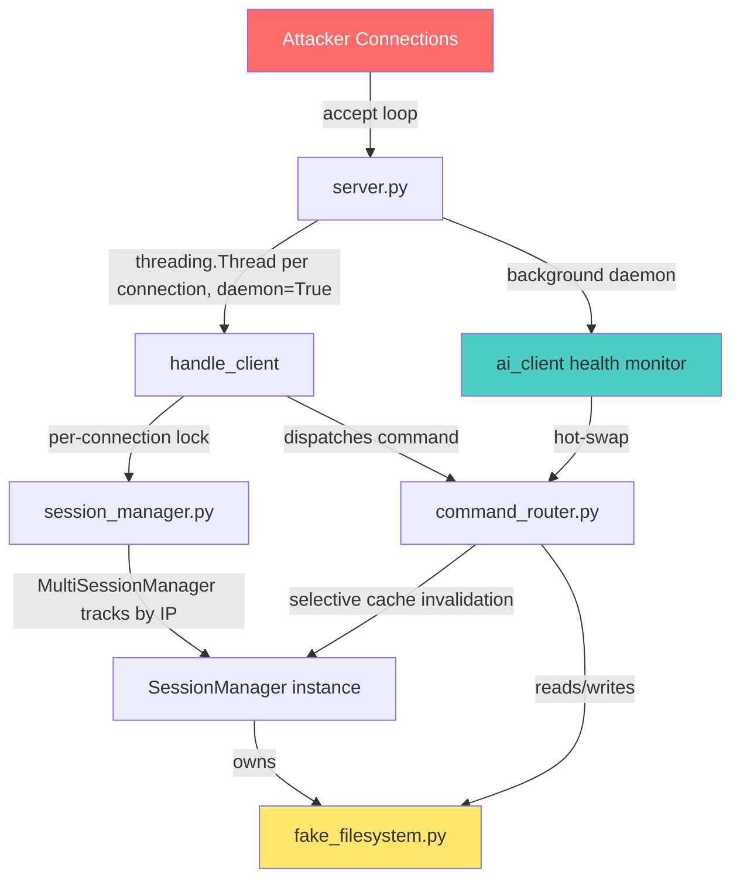
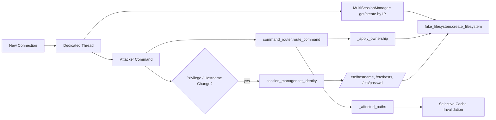
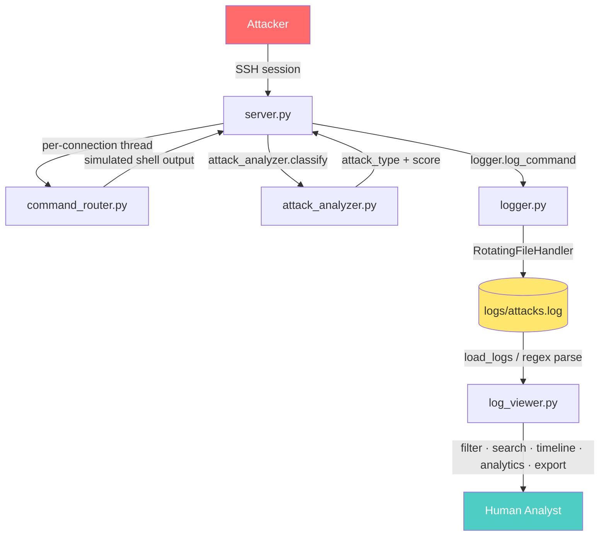
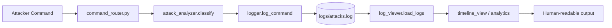

# 🐝 Xynera – Honey for Hackers

---

## ⚙️ Run the System (Backend + Frontend)

### 🔹 Step 1: XYNERA-AI (AI Backend)

| Step         | Command                           |
| ------------ | --------------------------------- |
| Go to folder | `cd xynera-ai`                    |
| Create env   | `python -m venv venv`             |
| Activate env | `venv\Scripts\activate` (Windows) or `source venv/bin/activate` (Linux/Mac) |
| Install deps | `pip install -r requirements.txt` |
| Run server   | `python api_server.py`            |

---

### 🔹 Step 2: XYNERA-HONEYPOT (Honeypot Service)

| Step         | Command                           |
| ------------ | --------------------------------- |
| Go to folder | `cd xynera-honey`                 |
| Create env   | `python -m venv venv`             |
| Activate env | `venv\Scripts\activate` (Windows) or `source venv/bin/activate` (Linux/Mac) |
| Install deps | `pip install -r requirements.txt` |
| Run server   | `python server.py`                |

---

### 🔹 Step 3: XYNERA-UI (React Dashboard)

| Step         | Command                           |
| ------------ | --------------------------------- |
| Go to folder | `cd UIprogress/dashboard-integrated` |
| Install deps | `npm install`                     |
| Run server   | `npm run dev`                     |

---

## ✅ System Status

All systems should now be running.

---

## 🧪 Testing the Servers

### 🔹 Option 1: Curl Test

```bash
curl -X POST http://10.200.200.30:5000/process \
-H "Content-Type: application/json" \
-d '{"ip":"10.200.200.10","command":"nmap test"}'
```

---

### 🔹 Option 2: Attacker Machine

```bash
nc 10.200.200.20 2222
```

Then execute commands.

---

# 📌 Current Condition of the System

---

## 📁 Honeypot Server Structure

```
Honeypot Server
│
├── server.py
├── session_manager.py
├── command_router.py
├── fake_filesystem.py
├── fake_process.py
├── fake_network.py
└── ai_client.py
```

---

## 🎯 Purpose of Deception Layer

The honeypot is the **fake system attackers interact with**.

---

## 🧱 Architecture Overview

```
Attacker (Kali)
        │
        ▼
Honeypot Server (Deception Layer)
        │
        ▼
AI Backend (Intelligence Layer)
```

---

## 🔄 Data Flow

```
Attacker Command
        │
        ▼
server.py
        │
        ▼
command_router.py
        │
 ┌──────┴───────────────┐
 ▼                      ▼
Local Simulation        AI Backend
(fake modules)          (via ai_client)
        │                      │
        ▼                      ▼
Response               AI-generated response
        │                      │
        └──────────────┬───────┘
                       ▼
               Sent back to attacker
```

---

# 📂 File Responsibilities

---

## 🔹 server.py

**Handles:**

```
socket connection
input/output loop
session creation
command handling
```

---

## 🔹 session_manager.py

**Stores per-attacker data:**

| Field    | Description       |
| -------- | ----------------- |
| IP       | Attacker IP       |
| cwd      | Current directory |
| commands | Command history   |

**Example:**

```python
sessions = {
  "session_id": {
     "ip": "10.200.200.10",
     "cwd": "/",
     "commands": []
  }
}
```

---

## 🔹 command_router.py

**Decides routing:**

| Command Type    | Execution |
| --------------- | --------- |
| ls, ps, netstat | Local     |
| nmap, wget      | Backend   |

---

## 🔹 fake_filesystem.py

**Simulates:**

```
ls
cd
pwd
cat
```

**Example Structure:**

```
/
├── home
│   └── ubuntu
│       └── notes.txt
├── etc
│   └── passwd
```

---

## 🔹 fake_process.py

**Simulates:**

```
ps
top
```

**Example Output:**

```
USER       PID %CPU %MEM COMMAND
root         1  0.0  0.1 /sbin/init
root       221  0.0  0.2 sshd
mysql      334  0.4  1.3 mysqld
```

---

## 🔹 fake_network.py

**Simulates:**

```
netstat
ss
```

**Example:**

```
tcp   0.0.0.0:22        LISTEN
tcp   0.0.0.0:80        LISTEN
tcp   127.0.0.1:3306    LISTEN
```

---

## 🔹 ai_client.py

**Connects to backend:**

```
POST /process
```

**Request:**

```json
{
 "ip": "10.200.200.10",
 "command": "nmap target"
}
```

**Response:**

```json
{
 "reply": "...",
 "attack_type": "...",
 "score": ...,
 "threat_level": "..."
}
```

---

# ⚠️ Important Design Rules

---

## ❗ Rule 1 — Never Execute Real Commands

```
No os.system()
No subprocess
```

---

## ❗ Rule 2 — Always Return Something

```
fallback → "command not found"
```

---

## ❗ Rule 3 — No Visible Crashes

Never expose:

```
traceback
error
timeout
```

---

## ❗ Rule 4 — Keep It Believable

```
realistic outputs
consistent filesystem
(optional later: slow responses)
```

---

# 💻 Example Interaction

```
$ whoami
ubuntu

$ ls
home
var
etc

$ ps
USER PID ...

$ netstat
tcp 0.0.0.0:22 LISTEN

$ nmap target
Starting Nmap...

$ wget malware.sh
--2026-- Downloading...
```

---

# 🔗 Final System (Combined)

```
Kali Attacker
        │
        ▼
Honeypot Server
        │
        ▼
AI Backend
        │
        ▼
RAG Engine
        │
        ▼
Deception Output
```

---

# 🤖 AI Backend

---

## 📁 Structure

```
AI Backend
│
├── API Layer
│     api_server.py
│
├── Detection Layer
│     classifier.py
│
├── Behavior Layer
│     attacker_profile.py
│
├── Threat Analysis Layer
│     threat_engine.py
│
├── Logging Layer
│     logger.py
│
└── Config Layer
      config.py


rag_engine.py
│
├── embedding step      → bge-m3
├── vector search       → FAISS
├── reasoning           → deepseek-r1
└── deception response  → tinyllama
```


#                                                                            XYNERA — Frontend Progress

# ⚙️ XYNERA — Concurrency, State & Simulation Core

> The engine room of the XYNERA SSH honeypot: the layer that lets multiple attackers exist at once, each inside their own fully consistent, mutable fake Linux box.

---

Logging tells you *what* an attacker did. This subsystem is what makes sure the attacker had something believable to do it to — and that XYNERA can handle more than one of them at a time without state bleeding between sessions.

Four modules work together here: a **thread-safe listener** that never blocks on a single connection, a **state controller** that keeps every attacker's identity consistent across the whole simulation, a **tree-based virtual filesystem** that behaves like a real disk instead of a wall of static text, and a **routing layer** that ties commands to that filesystem efficiently, with caching and realistic ownership.

```
🔌 Concurrent Connections  →  🧠 Per-Session Identity  →  📁 Mutable Sandbox  →  🔀 Realistic Routing
```

This document covers `server.py`, `session_manager.py`, `fake_filesystem.py`, and `command_router.py` exactly as implemented in the V3.3 baseline.

---

## 🏗️ Core Engine Architecture



---

## 📦 Module Responsibilities

| Module | Responsibility | Key Output |
|---|---|---|
| `server.py` | Accepts connections, spins up one thread per attacker, monitors AI backend health in the background | Live, non-blocking multi-attacker TCP service |
| `session_manager.py` | Tracks per-attacker state, keeps identity consistent across the whole simulated filesystem | `SessionManager` / `MultiSessionManager` instances |
| `fake_filesystem.py` | Provides an isolated, mutable, tree-structured virtual filesystem per session | `Node` tree (files/directories) with real metadata |
| `command_router.py` | Dispatches parsed commands against the filesystem and session state, with caching and ownership handling | Realistic shell responses (`uptime`, `w`, `ls -l`, etc.) |

---

## 🔄 Complete Execution Workflow

1. `server.py` starts `ai_client.start_health_monitor()` as a background daemon thread, then enters its `accept()` loop.
2. Every new connection is handed to `handle_client()` on its **own daemon thread**, so N attackers are served concurrently instead of queued behind a single accept loop.
3. `session_manager.py` generates a UUID4 session ID first — this same ID later seeds the attacker's virtual filesystem — then registers the session in `MultiSessionManager`, keyed by attacker IP.
4. `fake_filesystem.create_filesystem(session_id)` builds an isolated clone of the base OS template for that session, optionally pre-seeded with AI-generated content via `data_generator.get_generated_all(seed=...)`.
5. As the attacker types, `command_router.py` resolves filesystem-write commands (`touch`, `mkdir`, `rm`, `mv`, `cp`) to their affected paths, applies the session's simulated UID/GID as file ownership, and selectively invalidates only the cache entries touching those paths.
6. If the attacker escalates privileges or changes hostname, `session_manager.set_identity()` fires: it rewrites `/etc/hostname`, `/etc/hosts`, and `/etc/passwd` inside the *actual* virtual filesystem, updates the `$USER`/`$PWD` environment block, and refreshes the live prompt — instantly and consistently.
7. Every command handled under a session acquires that session's `command_lock` (an `RLock`), so two connections sharing one `SessionManager` (e.g. repeat connections from the same IP) can never interleave filesystem or history mutations.
8. If the AI backend goes down or comes back, the health-monitor thread flips `ai_client`'s shared availability flag — `command_router.py` picks that up on the very next fallback command, no restart required.

---

## 🔬 Individual Module Breakdown

### `server.py`

**Purpose:** The connection edge of the honeypot — turns a raw TCP listener into a concurrent, self-healing service.

**Internal workflow:**
- Wraps the accept loop so each `conn, addr` pair is immediately handed to a new `threading.Thread(target=handle_client, daemon=True)` — connections are never processed sequentially.
- Calls `ai_client.start_health_monitor()` once at startup, which is safe to call repeatedly (it no-ops if the monitor thread is already alive).
- Uses a module-level `print_lock` around all console output so interleaved attacker sessions don't garble the operator's terminal.

**Role in architecture:** The only module that owns the raw socket and the thread lifecycle for every attacker connection.

**Interaction with other modules:** Imports `ai_client`, `command_router.route_command`, `session_manager.SessionManager`/`MultiSessionManager`, `attack_analyzer`, and `logger` — it's the coordination point that ties the whole engine together per request.

---

### `session_manager.py`

**Purpose:** The single source of truth for "who is this attacker, right now" — and the module responsible for making sure that truth is reflected everywhere else in the simulation.

**Internal workflow:**
- `MultiSessionManager` holds one `SessionManager` per attacker IP, guarded by its own `threading.Lock` so concurrent connections from different (or the same) IPs never corrupt each other's state.
- `SessionManager` itself uses a `threading.RLock` (`command_lock`) around command handling, so multiple live connections that legitimately share one session never race on `cwd`, filesystem, or history mutations.
- `set_identity()` is the propagation point: on privilege escalation or hostname change it rewrites `/etc/hostname`, `_render_hosts()` rewrites `/etc/hosts` (replacing any stale `127.0.1.1` entry), and `_render_passwd()` rewrites `/etc/passwd` — all inside the attacker's *own* virtual filesystem, not just in memory.
- Maintains a `backend_cache` dict (`filesystem`, `responses`, `identity`, `services`, `metadata`) with targeted invalidation helpers (`invalidate_backend(path=None)`) so a single file write doesn't force a full cache wipe.

**Role in architecture:** Sits between the router and the filesystem, making sure every subsystem that cares about "who is logged in" sees the same answer at the same time.

**Interaction with other modules:** Owns and creates the session's `fake_filesystem.py` instance; is read and written by `command_router.py` on nearly every command; supplies the `session_id` that `logger.py` stamps onto log lines.

---

### `fake_filesystem.py`

**Purpose:** Replaces static, hardcoded command output with a real, walkable, mutable filesystem tree — so the sandbox behaves like an OS instead of a script.

**Internal workflow:**
- `Node` is the shared base class for both files and directories, carrying a `name`, `parent` reference, and a `Metadata` object (`owner`/`group` exposed as properties that read/write through to that metadata).
- `Metadata` tracks realistic per-file state — ownership, permissions, and creation/modification timestamps — updated as the attacker runs `touch`, `mkdir`, `rm`, `cp`.
- `create_filesystem(session_id)` returns a fresh clone of a base `ORIGINAL_FILESYSTEM` template for every session; if a `session_id` is supplied, it additionally hashes that ID (`hashlib.md5`) into a seed, imports `data_generator.get_generated_all(seed=...)` from the sibling `xynera-ai` package, and merges the generated dataset into the session's file contents before the attacker's first command.

**Role in architecture:** The actual "disk" every other module reads from and writes to — command router output, `ls -l` ownership, and identity rewrites all resolve against this tree.

**Interaction with other modules:** Instantiated per-session by `session_manager.py`; read and mutated by `command_router.py`'s file-handling commands; its `/etc/passwd` and `/etc/hosts` entries are the exact target of `session_manager.set_identity()`'s rewrites.

---

### `command_router.py`

**Purpose:** Turns a parsed attacker command into a filesystem-consistent, session-aware response — efficiently.

**Internal workflow:**
- Replaced hardcoded `uptime`/`w`/`who` output with a persistent `SYSTEM_BOOT_TIME` reference computed once at import time; each call derives real elapsed uptime and reflects the attacker's actual login IP and session duration.
- `_affected_paths(command, filesystem, cwd, session_manager)` resolves every non-flag path operand in filesystem-write commands (`touch`/`mkdir`/`rm`/`mv`/`cp`), so `session_manager.invalidate_backend()` only has to drop cache entries for paths that actually changed — not the whole cache.
- Newly created files/directories have their owner and group set via `session_manager._apply_ownership(dest_path, owner, group)`, pulling directly from the active session's simulated username/groups, so every new node inherits the attacker's live UID/GID.
- Falls back to `ai_client.send_to_ai()` only when no static routing rule matches a command, keeping the fast, deterministic path for common commands and reserving the AI backend for the unexpected ones.

**Role in architecture:** The dispatch layer that connects attacker input to both the filesystem and the identity/caching machinery in `session_manager.py`.

**Interaction with other modules:** Reads and writes through `fake_filesystem.py`; calls into `session_manager.py` for ownership and cache invalidation; calls `ai_client.py` (not `replay.py` — see the Logging & Replay subsystem doc) for AI fallback responses.

---

## 🔀 Internal Data Flow



---

## 🔗 Integration with the Entire Honeypot

| Module | How it connects to the Core Engine |
|---|---|
| `logger.py` | Consumes the `session_id` minted by `session_manager.py` on every logged command |
| `attack_analyzer.py` | Its `classify()` output flows into `command_router.py`'s decision of whether to answer statically or fall back to the AI backend |
| `ai_client.py` | The health-monitor daemon started by `server.py` continuously informs `command_router.py`'s AI-fallback path of backend availability |
| `deception_engine.py` | Sits in front of `command_router.py`, so any command it intercepts never reaches the routing/filesystem layer described here |

---

## 💡 Why This Subsystem Matters

- **Realism under load** — a honeypot that blocks on one attacker, or lets two attackers see each other's files, breaks the illusion immediately. Thread-per-connection plus per-session locking prevents both.
- **Consistency after privilege escalation** — an attacker who becomes `root` and checks `/etc/passwd` should see themselves reflected there; `set_identity()` is what makes that true instead of just updating an in-memory flag.
- **Performance without sacrificing accuracy** — selective cache invalidation means the router doesn't have to choose between "fast" and "correct" after every file write.
- **A believable sandbox** — ownership inheritance, real metadata, and AI-seeded content are what separate a tree of empty folders from something an attacker will actually explore and trust.

---

## ✅ Key Features

- [x] Thread-per-connection TCP server with daemon threads (never blocks on a single attacker)
- [x] Background AI-backend health monitoring with automatic hot-swap to local fallback
- [x] Per-IP session tracking via `MultiSessionManager`
- [x] Reentrant per-session locking (`command_lock`) to prevent state corruption on concurrent commands
- [x] Live identity propagation across `/etc/hostname`, `/etc/hosts`, `/etc/passwd`, environment variables, and shell prompt
- [x] Tree-based, mutable virtual filesystem (`Node` + `Metadata`) isolated per session
- [x] AI-seeded filesystem content, keyed by session ID
- [x] Realistic file metadata: ownership, permissions, timestamps
- [x] Dynamic, non-hardcoded `uptime`/`w`/`who` output via `SYSTEM_BOOT_TIME`
- [x] Selective backend-cache invalidation on filesystem writes
- [x] Automatic UID/GID inheritance for newly created files and directories

---

## 🚀 Future Improvements

> Natural next steps suggested by the current architecture — not implemented today.

- 🔐 **Per-session filesystem quotas** to cap sandbox growth under sustained attacker activity.
- 🧵 **Configurable thread-pool limits** to bound resource use under connection floods.
- 📊 **Live session dashboard** surfacing `MultiSessionManager` state in real time (pairs well with the Logging & Replay subsystem's dashboards).
- 🧬 **Richer AI-seeded personas** — extending `data_generator.get_generated_all()` output beyond files into believable shell history and bash aliases.
- 🩺 **Configurable health-check strategy** (currently a fixed interval) for the AI backend monitor.

---

## 🌐 `fake_network.py` — The Server's Identity Card

Think of this file as the **honeypot's passport**. It decides, once and for
all, who this fake machine claims to be — and then never contradicts itself.

**Fixed identity constants:**
- Hostname (`web-prod-01`), IP, netmask, broadcast, MAC, IPv6 link-local — all
  hardcoded so every command that reveals network identity tells the *same*
  story.
- `SERVICES`: a single shared list of `(proto, address, port, pid, program)`
  tuples — the **one and only source of truth** for what's "listening" on
  this box. `netstat`, `netstat -tulpn`, `ss`, and `service_manager.py` all
  read from this same list, so nothing can ever drift out of sync.

**The DNS illusion — `_resolve_domain()` / `_DNS_CACHE`:**
Instead of generating a random IP every time an attacker looks up a domain,
this uses a **seeded random generator** (`random.Random(domain_name)`) so a
domain always resolves to the *same* fake IP for the life of the process —
then caches it. Ask for `evil.com` twice, get the same answer twice. Realism
through consistency, not randomness.

**Command simulations included:**

| Category | Commands | What they simulate |
|---|---|---|
| Discovery | `netstat()`, `netstat_tulpn()`, `ss()` | Listening ports + live connections, service-aware |
| Interfaces | `ifconfig()`, `ip_addr()` | eth0/lo interface details, byte/packet counters |
| Lateral movement | `ssh()`, `scp()`, `telnet()`, `ftp()` | Realistic failure modes (refused / timeout / no route / bad auth) with weighted randomness |
| Reachability | `ping()`, `traceroute()` | Randomized latency, packet loss, and hop behavior |
| DNS | `dig()`, `nslookup()`, `host()` | Full DNS tool output, backed by the shared cache |

The clever bit: **every one of these accepts a `service_manager`**, so if an
attacker stops `nginx` mid-session, `netstat` immediately stops showing port
80 — no restart, no reload, just instant, believable consistency.

---

## 🧠 `service_manager.py` — The Session's Memory

If `fake_network.py` is the passport, this is the **short-term memory** of
one specific attacker's visit.

A honeypot that forgets what the attacker just did (e.g., they run
`service nginx stop`, and five commands later `nginx` mysteriously
reappears) breaks the illusion instantly. `ServiceManager` exists to make
sure that never happens.

**How it works:**
- One `ServiceManager` instance = one attacker session, fully isolated from
  every other concurrent session.
- On creation, it deep-copies default service states (`active (running)`)
  built directly from `fake_network.SERVICES` — so port numbers and PIDs
  can *never* disagree between the two files.
- Every service action an attacker can type is covered:
  - `start()`, `stop()`, `restart()` → backing state machine
  - `handle_service_command()` → the actual `service <name> {start|stop|restart}` CLI verb
  - `systemctl_status()` / `systemctl_overview()` → systemd-style status output
  - `netstat_lines()`, `netstat_tulpn_lines()`, `ss_lines()` → alternate rendering paths kept in lockstep with `fake_network.py`

**Why this matters for the honeypot's credibility:** an attacker probing with
`service mysql stop` → `netstat` → `ps aux` → `systemctl status mysql` should
get four *different-looking* commands that all tell the *same* story. That
cross-command consistency is the whole point of this module's existence.

---

## 🧬 `fake_process.py` — The Process Table Mirror

This file answers the question: *"If I stopped a service, would the process
table actually notice?"*

**`ps()` and `ps_aux()`** render Linux-realistic process listings —
`systemd`, `kthreadd`, `cron`, `rsyslogd`, `fail2ban-server`, `mysqld`,
`nginx` (dual worker/master rows, just like real nginx) — but each
service-backed row is **conditionally shown** via `_service_active()`,
which asks the session's `ServiceManager` whether that program is currently
running.

- No `ServiceManager` supplied → everything shows as running (safe default
  for standalone/offline calls).
- `ServiceManager` supplied → a stopped service's row **quietly disappears**,
  and reappears with its *original PID* if restarted — exactly how a real
  respawned daemon would behave with a fixed init entry.

**Bug fix baked in:** `ps_aux()` takes a live `username` parameter instead of
hardcoding `"ubuntu"`, so the attacker's own shell row (`bash`, `ps aux`)
always reflects whoever is *actually* logged in during that session — even
after identity/session changes mid-engagement.

---

## 🧰 `fake_advanced.py` — The Utility Belt

The catch-all for commands that don't need a whole module of their own, but
still need to feel authentically Linux.

- **`chmod(args)`** — Full GNU Coreutils-style parsing:
  - Validates both **numeric** (`chmod 755`) and **symbolic** (`chmod u+x`)
    modes via regex, rejecting malformed input the same way real `chmod`
    does.
  - Returns realistic `Operation not permitted` errors for sensitive paths
    (`/root`, `/etc/shadow`, `/etc/passwd`) — because a honeypot that lets
    attackers "successfully" chmod `/etc/shadow` gives the game away
    instantly.
  - Silent on success, matching real Unix philosophy.

- **`nc(args)`** — Netcat client *and* listener simulation:
  - Detects listener mode (`-l`) vs client mode, parses bundled flags like
    `-lvp 4444`, and returns the right flavor of silence or verbose output
    (`Listening on [0.0.0.0]...`, `Connection ... succeeded!`) depending on
    flags — covering the classic reverse-shell / port-scan patterns
    attackers actually type.

- **`get_common_error(command, target, error_type)`** — A tiny but important
  **shared error dictionary** (`not_found`, `permission_denied`, `no_file`,
  `is_directory`) so that *every* command across the entire honeypot returns
  bash-identical error phrasing instead of each command inventing its own
  slightly-different wording.

---

## 🔗 How It All Fits Together

1. **`fake_network.py`** declares the server's identity and its list of
   "real" services — the immutable ground truth.
2. **`service_manager.py`** layers **session-specific state** on top of that
   truth: who stopped what, and when, for *this* attacker only.
3. **`fake_process.py`** reflects that state into `ps`/`ps aux`, so the
   process table always matches the network table.
4. **`fake_advanced.py`** rounds out the illusion with the everyday
   utility commands (`chmod`, `nc`) and a shared error vocabulary that keeps
   every module speaking the same "bash dialect."

The result: an attacker can run `netstat`, `ss`, `ps aux`, `systemctl
status nginx`, and `chmod 777 nginx.conf` in any order, from any session,
and never once catch the honeypot contradicting itself.

---

# 🔹 Attack Analyzer (attack_analyzer.py)

## 📖 Overview

The **Attack Analyzer** is the first security analysis layer of the AI-Powered SSH Honeypot. It examines every command executed by an attacker, identifies the type of activity being performed, and assigns an appropriate threat score. The generated information helps other modules understand attacker behavior and respond accordingly.

Rather than relying on complex machine learning models, the module uses lightweight rule-based detection, making it fast, reliable, and easy to maintain while supporting future expansion with additional attack patterns.

---

## 🎯 Objectives

| Objective | Description |
|-----------|-------------|
| Command Analysis | Inspect every command executed by the attacker. |
| Attack Classification | Categorize commands into predefined attack types. |
| Threat Scoring | Assign a severity score for each detected attack. |
| Module Integration | Provide analysis results to other honeypot modules. |
| Scalability | Easily extend detection rules for new attack techniques. |

---

## ⚙️ Workflow

```text
                 Attacker Command
                        │
                        ▼
              Normalize Command
                        │
                        ▼
          Compare with Detection Rules
                        │
                        ▼
           Identify Attack Category
                        │
                        ▼
             Calculate Threat Score
                        │
                        ▼
      Forward Result to Other Modules
```

---

## 📂 Attack Categories

| Category | Purpose | Example Commands |
|----------|---------|------------------|
| 🔍 Reconnaissance | Collect system information | `ls`, `pwd`, `whoami`, `uname` |
| 📁 Directory Navigation | Explore directories | `cd` |
| 🔑 Credential Enumeration | Access sensitive files | `cat /etc/passwd` |
| 📥 Malware Download | Download payloads | `wget`, `curl` |
| 📤 File Transfer | Copy files between systems | `scp` |
| 🔓 Privilege Escalation | Gain elevated permissions | `sudo`, `su`, `chmod` |
| 🌐 Lateral Movement | Connect to remote systems | `ssh` |
| 💻 Reverse Shell | Create remote shell access | `nc`, `bash -i` |
| ❓ Unknown | Unrecognized activity | Any unmatched command |

---

## 📊 Threat Score Matrix

| Threat Level | Score |
|-------------|------:|
| Low | 5–20 |
| Medium | 60–80 |
| High | 90–95 |
| Critical | 100 |

---

## 🧩 Core Functions

| Function | Description |
|----------|-------------|
| `classify(command)` | Identifies the attack category based on command patterns. |
| `threat_score(attack_type)` | Returns the predefined severity score for the detected attack. |

---

## 🔗 Module Integration

```text
                     server.py
                         │
                         ▼
             attack_analyzer.py
              │       │        │
              ▼       ▼        ▼
         logger.py session_manager.py
                         │
                         ▼
                deception_engine.py
```

---

## ⭐ Key Features

| Feature | Benefit |
|---------|---------|
| Rule-Based Detection | Fast and efficient attack classification. |
| Threat Scoring | Measures attack severity consistently. |
| Lightweight Design | Minimal processing overhead. |
| Modular Architecture | Easy to extend with new detection rules. |
| Centralized Analysis | Provides standardized output to all modules. |
| Easy Maintenance | Detection rules can be updated independently. |

---

## 📌 Summary

The **Attack Analyzer** acts as the intelligence core of the honeypot's detection layer. By converting attacker commands into meaningful attack categories and threat scores, it enables accurate logging, session tracking, and adaptive deception while maintaining a lightweight and extensible architecture.

# 🔹 Malware Detector (malware_detector.py)

## 📖 Overview

The **Malware Detector** module is responsible for safely simulating malware-related activities inside the SSH Honeypot. Instead of performing actual downloads or file transfers, it generates realistic terminal outputs for commonly used commands such as `wget`, `curl`, and `scp`. This allows attackers to believe their actions were successful while ensuring the host system remains completely isolated and secure.

The module validates attacker-supplied targets using lightweight syntax checks without making DNS lookups, HTTP requests, or outbound network connections. By producing convincing command outputs, it strengthens the deception capabilities of the honeypot while preventing any real malware execution. :contentReference[oaicite:0]{index=0}

---

## 🎯 Objectives

| Objective | Description |
|-----------|-------------|
| Malware Simulation | Emulate malware download commands without real execution. |
| Safe Environment | Prevent outbound network communication from the honeypot. |
| Realistic Responses | Generate believable Linux terminal outputs. |
| Target Validation | Verify URLs and hostnames using syntax checks. |
| Deception Support | Keep attackers engaged with convincing responses. |

---

## ⚙️ Workflow

```text
                Attacker Command
                       │
                       ▼
               Extract Target
                       │
                       ▼
              Validate Target
                 │          │
          Valid  │          │ Invalid
                 ▼          ▼
     Generate Simulation   Return Error
                 │
                 ▼
      Return Simulated Output
```

---

## 📂 Supported Commands

| Command | Purpose | Simulated Response |
|---------|---------|--------------------|
| `wget` | Download remote files | Download progress, speed, completion message |
| `curl` | Retrieve remote content | Transfer statistics and progress output |
| `scp` | Secure file transfer | File transfer summary with completion details |

---

## 🧩 Core Functions

| Function | Description |
|----------|-------------|
| `extract_target(command)` | Extracts the target URL or filename from the attacker command. |
| `is_valid_target(target)` | Validates the syntax of URLs and hostnames. |
| `handle_wget(command)` | Simulates Linux `wget` output. |
| `handle_curl(command)` | Simulates Linux `curl` transfer output. |
| `handle_scp(command)` | Simulates secure file transfer without copying files. |

---

## 🔗 Module Integration

```text
               attack_analyzer.py
                        │
                        ▼
              deception_engine.py
                        │
                        ▼
             malware_detector.py
                        │
            ┌───────────┴───────────┐
            ▼                       ▼
     command_router.py       Simulated Output
```

---

## ⭐ Key Features

| Feature | Benefit |
|---------|---------|
| Safe Malware Simulation | Prevents real malware execution. |
| No Outbound Traffic | Blocks external network communication. |
| Dynamic Output | Uses randomized values for realistic responses. |
| URL Validation | Accepts only syntactically valid targets. |
| Lightweight Design | Fast execution with minimal overhead. |
| Modular Architecture | Easy to extend with additional download utilities. |

---

## 💡 Highlights

- Simulates **`wget`**, **`curl`**, and **`scp`** commands without contacting external systems.
- Produces realistic Linux terminal outputs using randomized values.
- Performs only syntax validation to maintain complete isolation.
- Integrates seamlessly with the **Deception Engine** to enhance attacker engagement.
- Prevents attackers from using the honeypot as a relay for malicious activities.

---

## 📌 Summary

The **Malware Detector** enhances the realism of the AI-Powered SSH Honeypot by safely emulating malware download and file transfer activities. Through realistic terminal simulations, secure validation, and seamless integration with the deception engine, it keeps attackers engaged while ensuring the underlying system remains fully protected and isolated. :contentReference[oaicite:1]{index=1}

---

# 🔹 Deception Engine (deception_engine.py)

## 📖 Overview

The **Deception Engine** is responsible for generating intelligent and realistic responses based on the attacker's actions. After an attack is classified, this module determines whether a custom deceptive response should be returned or if the command should continue through the normal execution flow.

It also maintains a lightweight attacker profile for each active session, ensuring interactions remain consistent and realistic throughout the attack. This modular design allows the honeypot to support future AI-driven deception while keeping the current implementation flexible and easy to extend. :contentReference[oaicite:0]{index=0}

---

## 🎯 Objectives

| Objective | Description |
|-----------|-------------|
| Adaptive Deception | Generate attack-specific responses. |
| Session Profiling | Maintain attacker intent throughout a session. |
| Dynamic Responses | Improve realism using customized outputs. |
| Modular Design | Separate deception logic from command execution. |
| AI Ready | Support future AI and RAG-based enhancements. |

---

## ⚙️ Workflow

```text
              Attacker Command
                     │
                     ▼
         Receive Attack Category
                     │
                     ▼
        Update Attacker Profile
                     │
                     ▼
       Select Deception Handler
             │             │
        Available      Not Available
             │             │
             ▼             ▼
 Generate Response   Continue Normal Flow
             │
             ▼
      Return Final Output
```

---

## 📂 Supported Deception Types

| Attack Type | Response |
|-------------|----------|
| 🔍 Reconnaissance | Simulates realistic system information. |
| 🔑 Credential Enumeration | Generates fake `/etc/passwd` and `/etc/shadow` data. |
| 📥 Malware Download | Delegates to `malware_detector.py`. |
| 🌐 Lateral Movement | Allows network simulation modules to respond. |
| 🖥 Reverse Shell | Placeholder for future implementation. |
| 🔓 Privilege Escalation | Reserved for future adaptive simulation. |

---

## 🧩 Core Functions

| Function | Description |
|----------|-------------|
| `update_profile()` | Stores attacker intent within the active session. |
| `get_dynamic_uptime()` | Generates randomized Linux uptime information. |
| `credential_enumeration_deception()` | Returns simulated credential files. |
| `malware_download_deception()` | Routes download commands to the malware detector. |
| `adapt_response()` | Selects and executes the appropriate deception handler. |

---

## 👤 Attacker Profiling

| Intent | Trigger |
|--------|---------|
| Reconnaissance | Information gathering commands |
| Credential | Access to `/etc/passwd` or `/etc/shadow` |
| Malware | Commands like `wget`, `curl`, or `nc` |

Maintaining these profiles allows the honeypot to produce more consistent and believable responses during an attack session. :contentReference[oaicite:1]{index=1}

---

## 🔗 Module Integration

```text
                attack_analyzer.py
                        │
                        ▼
              deception_engine.py
             │          │           │
             ▼          ▼           ▼
 malware_detector  command_router  session_manager
```

---

## ⭐ Key Features
| Feature | Benefit |
|---------|---------|
| Adaptive Responses | Generates context-aware deception. |
| Session Profiling | Tracks attacker intent during a session. |
| Dynamic System Data | Produces realistic and non-repetitive outputs. |
| Modular Handlers | Easy to add new deception strategies. |
| AI-Ready Design | Supports future intelligent deception. |
| Lightweight Architecture | Maintains performance with minimal overhead. |

---

## 💡 Why This Module Matters
The **Deception Engine** is the heart of the honeypot's realism. Instead of returning static outputs, it adapts responses based on attacker behavior, creating a more convincing environment while safely collecting valuable attack intelligence.

---

## 📌 Summary
The **Deception Engine** bridges attack analysis and response generation by delivering adaptive, attack-aware interactions. Through session profiling, dynamic content generation, and seamless integration with supporting modules, it significantly improves the effectiveness and realism of the AI-Powered SSH Honeypot. :contentReference[oaicite:2]{index=2}


# 🔹 AI Client (`ai_client.py`)

## 📖 Overview

The **AI Client** serves as the communication bridge between the SSH Honeypot and the AI backend. It forwards attacker commands along with session context to the backend, receives AI-generated responses, and returns them to the honeypot. This enables intelligent and context-aware interactions without tightly coupling the honeypot to the AI service.

To ensure reliability, the module continuously monitors backend availability. If the AI service becomes unavailable, it automatically switches to an offline fallback mode and seamlessly restores AI communication once the backend recovers. :contentReference[oaicite:0]{index=0}

---

## 🎯 Objectives

| Objective | Description |
|-----------|-------------|
| AI Communication | Exchange requests and responses with the AI backend. |
| Context Sharing | Send attacker commands and session information for analysis. |
| Health Monitoring | Continuously monitor backend availability. |
| Automatic Recovery | Restore AI communication after backend recovery. |
| Reliable Operation | Ensure uninterrupted honeypot functionality using fallback responses. |

---

## ⚙️ Communication Workflow

```text
            Attacker Command
                    │
                    ▼
            Prepare AI Request
                    │
                    ▼
       Check Backend Availability
             │              │
       Available      Unavailable
             │              │
             ▼              ▼
     Send Request     Return Fallback
             │
             ▼
      Receive AI Response
             │
             ▼
      Validate & Clean Data
             │
             ▼
      Return Final Response
```

---

## 📂 Core Components

| Component | Purpose |
|-----------|---------|
| `send_to_ai()` | Sends attacker requests to the AI backend. |
| `check_ai_backend()` | Verifies backend availability using the health endpoint. |
| `start_health_monitor()` | Starts the background health monitoring thread. |
| `_health_monitor_loop()` | Continuously monitors backend status. |
| `get_offline_fallback()` | Generates fallback responses when the backend is unavailable. |
| `clean_response()` | Removes unnecessary formatting before returning the response. |

---

## ❤️ Backend Health Monitoring

```text
        AI Backend
             │
             ▼
     Health Check (/health)
             │
      ┌──────┴──────┐
      ▼             ▼
   Online        Offline
      │             │
      ▼             ▼
 Use AI        Return Fallback
      │             │
      └──────┬──────┘
             ▼
     Continue Monitoring
```

---

## 🔗 Module Integration

```text
          command_router.py
                  │
                  ▼
             ai_client.py
          │             │
          ▼             ▼
   AI Backend      session_manager.py
          │
          ▼
 attack_analyzer.py
```

---

## ⭐ Key Features

| Feature | Benefit |
|---------|---------|
| AI Backend Integration | Enables intelligent response generation. |
| Health Monitoring | Continuously checks backend availability. |
| Automatic Recovery | Restores AI routing without restarting the server. |
| Offline Fallback | Keeps the honeypot operational during backend failures. |
| Persistent HTTP Session | Reduces communication overhead and improves efficiency. |
| Thread-Safe Design | Supports multiple concurrent attacker sessions safely. |

---

## 🔄 Response Lifecycle

| Stage | Action |
|-------|--------|
| Request | Collect attacker command and session context. |
| Processing | Forward request to the AI backend. |
| Validation | Verify the received response. |
| Cleanup | Remove unnecessary formatting. |
| Delivery | Return the final response to the attacker. |

---

## 💡 Why This Module Matters

The **AI Client** enables intelligent and adaptive interactions by connecting the honeypot with an external AI backend. Its built-in health monitoring, automatic recovery, and offline fallback mechanisms ensure reliable operation even during temporary backend failures, making the system resilient and scalable.

---

## 📌 Summary

The **AI Client** provides secure and reliable communication between the honeypot and the AI backend. Through continuous health monitoring, thread-safe request handling, automatic failover, and seamless recovery, it ensures uninterrupted AI-assisted deception while maintaining a modular architecture. :contentReference[oaicite:1]{index=1}

# 🔄 Overall System Workflow

The AI-Powered SSH Honeypot follows a modular workflow where each component performs a dedicated task while collaborating to provide a realistic and secure deception environment.

```text
                    Attacker
                        │
                        ▼
               SSH Connection
                        │
                        ▼
                  server.py
                        │
                        ▼
            attack_analyzer.py
                        │
        ┌───────────────┼───────────────┐
        ▼               ▼               ▼
 logger.py      session_manager.py  deception_engine.py
                                        │
                        ┌───────────────┴───────────────┐
                        ▼                               ▼
            malware_detector.py                command_router.py
                                                        │
                                                        ▼
                                                   ai_client.py
                                                        │
                                                        ▼
                                                   AI Backend
                                                        │
                                                        ▼
                                              Intelligent Response
```

---

# ✨ Key Features

| Feature | Description |
|---------|-------------|
| 🔍 Rule-Based Attack Detection | Classifies attacker commands into predefined attack categories. |
| 📊 Threat Scoring | Assigns severity scores based on attacker behaviour. |
| 🎭 Adaptive Deception | Generates realistic responses to mislead attackers. |
| 📥 Malware Simulation | Safely emulates malware download and transfer commands. |
| 🤖 AI Integration | Uses an external AI backend for intelligent response generation. |
| ❤️ Health Monitoring | Continuously checks AI backend availability. |
| 🔄 Automatic Recovery | Restores AI communication without restarting the server. |
| 📜 Session Management | Maintains attacker history and behavioural profiles. |
| 📝 Comprehensive Logging | Records attacker commands, sessions, and threat information. |
| ⚡ Multi-Client Support | Handles multiple attacker sessions concurrently. |

---

# 🧭 XYNERA — Logging & Attack Replay Subsystem

> The forensic backbone of the XYNERA SSH honeypot: every attacker command becomes a structured, queryable, replayable record.

---

## 🎯 Hero

An SSH honeypot is only as useful as the trail it leaves behind. XYNERA can simulate a filesystem, fake a shell, and improvise responses all day long — but none of that has analytical value unless the attacker's behaviour is **captured, stored, and made explorable after the fact**.

That is the job of this subsystem. It sits quietly behind every live session, turning raw attacker input into a durable, rotating log file, and then gives analysts a rich CLI to interrogate that log: filter it, score it, graph it, export it, and **replay it back at the same pace the attacker typed it**.

```
🖥️  Live Attack  →  📝 Structured Log  →  🔍 Analyst Investigation
```

This part covers the three modules that make that pipeline work — `logger.py`, `log_viewer.py`, and `replay.py`.
---

## 🏗️ Logging & Replay Architecture



> **Note on scope:** `logger.py` is called directly by `server.py`, not by `command_router.py`. The router is responsible for producing the attacker-visible *response*; logging happens as a separate step once the command has been classified.

---

## 📦 Module Responsibilities

| Module | Responsibility | Key Output |
|---|---|---|
| `logger.py` | Writes every classified command to a rotating on-disk log with a consistent, parseable format | `logs/attacks.log` (rotating, 5 MB × 3 backups) |
| `log_viewer.py` | Standalone analyst CLI — parses, filters, searches, replays, graphs, and exports the log | Terminal reports, Matplotlib graphs, JSON/CSV exports |
| `replay.py` | A duplicate, unwired copy of an early AI-backend client (see [module breakdown](#-replaypy) below) | N/A — not imported anywhere else in the codebase |

---

## 🔄 Complete Execution Workflow

1. **Attacker connects** to `server.py`, which spins up a dedicated thread per TCP connection.
2. The attacker types a command; `command_router.py` matches it against XYNERA's routing tables (or falls back to the AI backend via `ai_client.py`) to build the simulated response.
3. In parallel, `server.py` calls `attack_analyzer.classify(command)` to tag the command with an **attack type** (e.g. `Reconnaissance`, `Credential Enumeration`, `Malware Download`).
4. `attack_analyzer.threat_score(attack_type)` converts that tag into a numeric severity score, which is also folded into the session's running threat score via `session_manager`.
5. `server.py` calls `logger.log_command(command, attack_type, ip_address, session_id)`.
6. `logger.py` looks up the same score from `SHARED_ATTACK_SCORES`, formats a single log line, and writes it through a `RotatingFileHandler` to `logs/attacks.log`.
7. At any later point, an analyst runs `log_viewer.py` directly from the terminal.
8. `log_viewer.py` loads and regex-parses `attacks.log` (or `attacks.json`, if present) into structured dictionaries.
9. The analyst chooses from a 24-option menu — read, filter, search, **replay the session's timeline at real pacing**, chart the data, or export a report.

---

## 🔬 Individual Module Breakdown

### `logger.py`

**Purpose:** The single write-path for attacker activity. It exists so every other module — server, router, viewer — agrees on one log format.

**Internal workflow:**
- On import, `setup_logger()` creates the `logs/` directory if needed and configures a dedicated `attack_logger` with a `RotatingFileHandler` (`MAX_BYTES = 5MB`, `BACKUP_COUNT = 3`), guarding against duplicate handler registration if called twice.
- `log_command(command, attack_type, ip_address, session_id, severity)` is the only public entry point. It:
  - Looks up a numeric score for the attack type from `attack_analyzer.SHARED_ATTACK_SCORES` (imported directly, so logger and analyzer never disagree on scoring).
  - Resolves the requested `severity` string to a real `logging` level, defaulting to `INFO`.
  - Formats a single-line message: `IP=... | SESSION=... | TYPE=... | SCORE=... | CMD=...`.

**Role in architecture:** Terminal node of the live attack path — the last thing that happens to a command before it becomes durable evidence.

**Interaction with other modules:** Imports `SHARED_ATTACK_SCORES` from `attack_analyzer.py`; is imported and called by `server.py` immediately after classification.

<details>
<summary>📄 Log line format produced by <code>logger.py</code></summary>

```
[2026-07-30 14:02:11] [INFO] IP=192.168.1.44 | SESSION=b3f1... | TYPE=Reconnaissance | SCORE=20 | CMD=whoami
```

</details>

---

### `log_viewer.py`

**Purpose:** The analyst-facing half of the subsystem — a full CLI dashboard built on top of the log file `logger.py` produces.

**Internal workflow:**
- `load_logs()` reads `logs/attacks.log` line by line against a compiled regex (`LOG_PATTERN`) that mirrors `logger.py`'s exact output format, turning each line into a dict of `timestamp`, `severity`, `ip`, `session`, `attack_type`, `score`, `command`.
- `load_json_logs()` offers an alternate path for a structured `logs/attacks.json`, if one exists.
- A large family of functions then operate on that list of dicts.

**Important functions, grouped by what they do:**

| Category | Functions |
|---|---|
| 🔎 Inspection | `latest_logs`, `filter_ip`, `filter_attack`, `filter_severity`, `session_logs`, `search_command`, `search_time_range`, `sort_logs` |
| ⏱️ Replay | `timeline_view` |
| 📊 Analytics (text) | `threat_summary`, `command_frequency`, `top_attackers`, `dashboard`, `statistics`, `session_statistics`, `ip_intelligence` |
| 📈 Analytics (graphs, via Matplotlib) | `attack_distribution_graph`, `severity_distribution_graph`, `top_attackers_graph`, `threat_score_graph`, `command_frequency_graph`, `timeline_graph`, `analytics_dashboard` |
| 📤 Export | `export_json`, `export_csv`, `generate_report` |
| 🔮 Future placeholders | `ai_anomaly_detection`, `rag_context_lookup`, `threat_intelligence` (each simply prints `[Future Feature] ...`) |
| 🧭 Entry point | `menu()` — a 24-option CLI loop, run when the file is executed directly |

**The replay mechanism, specifically:** `timeline_view(logs)` sorts all entries chronologically and then walks through them printing each one — but before printing the next entry, it sleeps for the real gap between the two original timestamps, **capped at 5 seconds**. This is what actually delivers "attack replay": the attacker's session is played back at (a bounded version of) the speed it originally happened, rather than dumped instantly.

**Role in architecture:** The read/query surface of the subsystem — the only module in this trio actually designed for a human to sit in front of.

**Interaction with other modules:** Imports `threat_score` from `attack_analyzer.py` to compute severity weightings for its dashboards and graphs; consumes the exact file format `logger.py` writes.

---

### `replay.py`

**Purpose (as implemented):** Despite the name, this module does **not** read, sort, or play back log entries. It defines `send_to_ai(ip, command, history, attack_type)` — a synchronous HTTP client that posts a command payload to `http://10.200.200.30:5000/process` and returns a cleaned text reply.

**Internal workflow:**
- Builds a JSON payload (`ip`, `command`, `history`, `local_attack_type`) and POSTs it with a 335-second timeout.
- Handles non-200 responses, invalid JSON, request timeouts, and connection errors, each returning `None` on failure.
- `clean_response()` strips Markdown code fences from the AI's reply before returning it.

> ⚠️ **Accuracy note:** A `grep` across the full baseline shows this module is not imported anywhere else in the codebase. The live AI-integration path used by `command_router.py` goes through a separate, more capable module — `ai_client.py` — which adds connection pooling, retries, a background health-monitor thread, and an offline fallback payload. `replay.py` appears to be an earlier or duplicate draft of that same idea that was never wired in, consistent with it having been flagged during merge review as a stale copy. It is documented here for completeness because it ships in the baseline, but **the "attack replay" functionality described elsewhere in this document is `log_viewer.py`'s `timeline_view()`, not this file.**

---

## 🔀 Internal Data Flow



---

## 🔗 Integration with the Entire Honeypot

| Module | How it connects to Logging & Replay |
|---|---|
| `server.py` | Owns the per-connection thread loop; is the **only** caller of `logger.log_command()`, invoking it right after classification on every attacker command |
| `command_router.py` | Produces the simulated response the attacker sees, and supplies the `attack_type` context used downstream; does not call the logger itself |
| `session_manager.py` | Generates the UUID4 `session_id` that `logger.py` stamps onto every log line, and tracks the same running threat score that `log_viewer.py` later recomputes from the log |
| `attack_analyzer.py` | Supplies both the classification (`classify()`) and the shared scoring table (`SHARED_ATTACK_SCORES` / `threat_score()`) that `logger.py` and `log_viewer.py` both depend on for consistent severity numbers |
| `deception_engine.py` | Sits upstream of `command_router.py`, shaping which commands even reach the router — it does not call the logging subsystem directly, but every command it lets through still gets classified and logged as usual |

---

## 💡 Why This Subsystem Matters

- **Forensic analysis** — `attacks.log` is the durable, tamper-evident record of everything an attacker did, independent of whatever the live session simulated back to them.
- **Debugging the honeypot itself** — session-by-session and IP-by-IP breakdowns (`session_statistics`, `ip_intelligence`) make it easy to spot routing gaps or misclassifications during development.
- **Attack investigation** — filtering by IP, command keyword, time range, or attack type turns a flat log file into a searchable case file.
- **Behavioural replay** — `timeline_view()` lets an analyst watch an attacker's session unfold at (near) real speed, which is far more revealing of intent than a static list of commands.
- **Behavioural analytics** — the Matplotlib-backed graphs (attack distribution, threat trend, top attackers) turn raw text logs into shareable visual evidence.
- **A foundation for future AI work** — the placeholder functions (`ai_anomaly_detection`, `rag_context_lookup`, `threat_intelligence`) mark exactly where machine-driven analysis is meant to slot in next.

---

## ✅ Key Features

- [x] Structured, rotating file logging (`RotatingFileHandler`, 5 MB × 3 backups)
- [x] Shared attack-scoring table used consistently across logging and viewing
- [x] Regex-based log parsing tied precisely to `logger.py`'s output format
- [x] IP / attack-type / severity / command / time-range filtering
- [x] Session-wise log grouping
- [x] Paced timeline replay (capped at 5s between entries)
- [x] Text dashboards: threat summary, command frequency, top attackers, statistics
- [x] Matplotlib graphs: attack distribution, severity pie chart, top attackers, threat trend, command frequency, timeline
- [x] JSON and CSV export
- [x] Auto-generated summary report
- [x] Session and IP intelligence breakdowns
- [x] Optional JSON log source (`attacks.json`) alongside the primary text log

---

## 🚀 Future Improvements

> These are ideas suggested by the codebase's own placeholder functions — none of them are implemented today.

- 🧠 **AI Anomaly Detection** — the `ai_anomaly_detection()` stub is reserved for ML-based behaviour clustering and unusual-activity scoring.
- 📚 **RAG Context Lookup** — the `rag_context_lookup()` stub is reserved for retrieving similar historical attacks from a vector database.
- 🌐 **Threat Intelligence Enrichment** — the `threat_intelligence()` stub is reserved for VirusTotal / AbuseIPDB / GeoIP lookups and IOC enrichment.
- 🗺️ **MITRE ATT&CK mapping** for each classified attack type.
- 📡 **Live dashboard** instead of an on-demand CLI (e.g. a lightweight web view).
- 🔍 **Elasticsearch / Kibana integration** for large-scale log search and visualization.
- 📄 **PDF report generation** to complement the existing JSON/CSV export options.
- 🧩 **Wiring or retiring `replay.py`** — either integrate it properly (superseded by `ai_client.py`) or remove it to avoid confusion with `log_viewer.py`'s actual replay feature.

---

<div align="center">

**XYNERA Honeypot Project** | Progress on frontend | End of report

</div>

---

# 🤖 XYNERA AI

<p align="center">
  <strong>Adaptive Intelligence Engine for the XYNERA AI-Powered SSH Honeypot</strong>
  <br>
  Context-Aware • RAG-Powered • Threat-Aware • Session-Aware • Real-Time Deception
</p>

---

## Badges

<p align="center">


</p>

---

# 📖 Overview

**XYNERA AI** is the intelligent decision-making engine powering the **XYNERA AI-Powered SSH Honeypot**. It transforms traditional static honeypots into adaptive deception systems capable of understanding attacker behavior, maintaining realistic conversations, and generating context-aware responses in real time.

Unlike conventional honeypots that rely on predefined outputs, XYNERA AI combines **Retrieval-Augmented Generation (RAG)**, **behavioral profiling**, **threat analysis**, **adaptive personalities**, and **predictive intelligence** to create a highly believable Linux environment that continuously adapts to attacker actions.

Every command received from the honeypot is processed through a multi-stage AI pipeline that classifies the attack, evaluates risk, retrieves relevant contextual information, applies security guardrails, and generates realistic responses while preserving session consistency.

The AI backend is built with a modular architecture, allowing each intelligence component to operate independently while collaborating to provide fast, scalable, and secure deception. This design makes it easy to extend the system with new detection models, knowledge sources, personalities, and analytics capabilities.

---

# ✨ Key Features

- 🧠 **Adaptive AI Deception** using Retrieval-Augmented Generation (RAG)
- ⚡ **FastAPI-powered** high-performance asynchronous backend
- 📚 **FAISS Vector Database** for lightning-fast knowledge retrieval
- 🎯 **Threat Classification Engine** with multi-level risk scoring
- 👤 **Behavior Profiling** that tracks attacker actions throughout each session
- 🎭 **Dynamic AI Personalities** that adapt responses based on threat level
- 🔮 **Predictive Intelligence** for forecasting attacker intentions and next actions
- 🛡️ **Runtime Guardrails** preventing unsafe or unrealistic AI responses
- 📂 **Session-Aware Corporate Data Generation** with consistent fake identities
- 🔍 **Knowledge Base Retrieval** containing Linux commands, documents, credentials, and enterprise assets
- ⚙️ **Dynamic Configuration** without restarting the backend
- 📊 **Structured JSON Logging** for dashboards and attack analytics
- 🚀 **Local Command Simulation** for common Linux commands, reducing LLM calls
- 🔄 **Automatic Retry & Response Caching** for improved reliability and performance
- 🌐 **REST API** enabling seamless integration with the XYNERA Honeypot
- 📈 **Modular Architecture** designed for future AI models and security research

---
---

# 🏗️ Architecture Diagram

The AI backend follows a modular, pipeline-driven architecture where every component performs a dedicated task before passing enriched context to the next stage. This design enables scalable intelligence, realistic deception, and efficient request processing.

```text
                        ┌──────────────────────────┐
                        │   XYNERA Honeypot        │
                        │ (SSH / TCP Connection)   │
                        └─────────────┬────────────┘
                                      │
                                      ▼
                          POST /process (FastAPI)
                                      │
                                      ▼
                           ┌─────────────────────┐
                           │   API Server        │
                           │   api_server.py     │
                           └─────────┬───────────┘
                                     │
        ┌────────────────────────────┼─────────────────────────────┐
        ▼                            ▼                             ▼
┌────────────────┐         ┌─────────────────┐          ┌─────────────────┐
│ Classifier     │         │ Session Data    │          │ Attacker Profile│
└──────┬─────────┘         └────────┬────────┘          └────────┬────────┘
       │                            │                            │
       └──────────────┬─────────────┴──────────────┬─────────────┘
                      ▼                            ▼
              ┌─────────────────┐         ┌──────────────────┐
              │ Threat Engine   │────────▶│ Adaptive Persona │
              └────────┬────────┘         └────────┬─────────┘
                       │                           │
                       ▼                           ▼
                ┌────────────────────────────────────┐
                │        RAG Engine                  │
                │ Knowledge Base + Vector Store      │
                └────────────────┬───────────────────┘
                                 │
                                 ▼
                       Large Language Model
                                 │
                                 ▼
                         Guardrails Layer
                                 │
                                 ▼
                     Predictive Intelligence
                                 │
                                 ▼
                      Structured JSON Logger
                                 │
                                 ▼
                        API Response Returned
```

---

# ⚙️ AI Processing Pipeline

Every attacker command passes through multiple intelligence layers before a response is generated.

| Stage | Module | Responsibility | Output |
|-------|--------|---------------|--------|
| 1 | `api_server.py` | Receives API request and orchestrates the pipeline | Request Context |
| 2 | `classifier.py` | Detects attack type and assigns risk score | Attack Classification |
| 3 | `attacker_profile.py` | Maintains attacker history and behavioural metrics | Session Profile |
| 4 | `threat_engine.py` | Calculates dynamic threat severity | Threat Level |
| 5 | `personalities.py` | Selects adaptive AI persona | Personality Context |
| 6 | `knowledge_base.py` | Retrieves Linux commands and enterprise documents | Retrieved Context |
| 7 | `vector_store.py` | Performs semantic similarity search using FAISS | Relevant Knowledge |
| 8 | `rag_engine.py` | Generates context-aware AI responses | AI Response |
| 9 | `guardrails.py` | Filters unsafe or unrealistic outputs | Safe Response |
| 10 | `predictive_engine.py` | Predicts attacker intentions and deception success | Analytics |
| 11 | `logger.py` | Stores structured security events | JSON Logs |
| 12 | FastAPI | Returns the final response to the Honeypot | API Response |

### 🔄 Request Workflow

```text
Attacker Command
        │
        ▼
Receive API Request
        │
        ▼
Attack Classification
        │
        ▼
Session & Behaviour Analysis
        │
        ▼
Threat Scoring
        │
        ▼
Adaptive Personality Selection
        │
        ▼
Knowledge Retrieval (FAISS)
        │
        ▼
LLM Response Generation
        │
        ▼
Security Guardrails
        │
        ▼
Predictive Analytics
        │
        ▼
Structured Logging
        │
        ▼
Response Returned
```

---

# 📂 Folder Structure

```text
xynera-ai/
│
├── api_server.py              # FastAPI backend entry point
├── classifier.py              # Attack classification engine
├── attacker_profile.py        # Behaviour profiling
├── threat_engine.py           # Threat scoring
├── personalities.py           # Adaptive AI personalities
├── rag_engine.py              # Retrieval-Augmented Generation
├── knowledge_base.py          # Enterprise knowledge repository
├── vector_store.py            # FAISS vector search
├── predictive_engine.py       # Attack prediction
├── guardrails.py              # AI safety layer
├── logger.py                  # Structured logging
├── config.py                  # Dynamic configuration
├── dynamic_config.json        # Runtime configuration
├── requirements.txt
├── .env
├── cache/
├── logs/
├── knowledge/
└── README.md
```

### 📦 Core Modules

| Module | Purpose |
|---------|---------|
| `api_server.py` | FastAPI application and request orchestration |
| `classifier.py` | Detects attacker intent and assigns risk |
| `attacker_profile.py` | Tracks attacker behaviour across sessions |
| `threat_engine.py` | Calculates dynamic threat scores |
| `personalities.py` | Selects adaptive honeypot personalities |
| `rag_engine.py` | Generates AI responses using retrieved context |
| `knowledge_base.py` | Stores Linux, enterprise, and deception knowledge |
| `vector_store.py` | Semantic retrieval using FAISS |
| `guardrails.py` | Prevents unsafe AI responses |
| `predictive_engine.py` | Forecasts attacker behaviour |
| `logger.py` | Structured analytics and event logging |

---

# 🚀 Installation

## Prerequisites

| Requirement | Version |
|-------------|----------|
| Python | 3.10+ |
| pip | Latest |
| Git | Latest |
| Groq API Key | Required |

---

## Clone Repository

```bash
git clone https://github.com/Xenera-Cyber/Org-HoneyPot.git
cd Org-HoneyPot/xynera-ai
```

---

## Create Virtual Environment

### Windows

```bash
python -m venv venv
venv\Scripts\activate
```

### Linux / macOS

```bash
python3 -m venv venv
source venv/bin/activate
```

---

## Install Dependencies

```bash
pip install -r requirements.txt
```

---

## Run the Backend

```bash
python api_server.py
```

The API will start at:

```
http://localhost:5000
```

---

# 🔐 Environment Variables

Create a `.env` file inside the project root.

```env
# ===============================
# API Configuration
# ===============================
HOST=0.0.0.0
PORT=5000

# ===============================
# LLM Configuration
# ===============================
GROQ_API_KEY=your_api_key_here
MODEL=llama-3.1-8b-instant

# ===============================
# RAG Configuration
# ===============================
VECTOR_DB=faiss
TOP_K=5

# ===============================
# Logging
# ===============================
LOG_LEVEL=INFO

# ===============================
# Runtime
# ===============================
DEBUG=False
```

## Environment Variable Reference

| Variable | Description | Default |
|----------|-------------|---------|
| `HOST` | API host address | `0.0.0.0` |
| `PORT` | Backend port | `5000` |
| `GROQ_API_KEY` | Groq API key | Required |
| `MODEL` | LLM model | `llama-3.1-8b-instant` |
| `VECTOR_DB` | Vector database | `FAISS` |
| `TOP_K` | Number of retrieved documents | `5` |
| `LOG_LEVEL` | Logging level | `INFO` |
| `DEBUG` | Debug mode | `False` |

---
---

### XYNERA-AI MODULE [EXPLANANTION] :-

1. **RAG Engine (`xynera-ai/rag_engine.py`)**
   - Built the Retrieval-Augmented Generation engine from scratch powering all AI deception responses.
   - Implemented local command simulation layer (pwd, whoami, echo, chmod, etc.) to bypass LLM calls for common commands — reducing latency to near-zero for ~40% of attacker commands.
   - Added async connection pooling (`httpx.AsyncClient`), in-memory response cache keyed on `(command, user, host, cwd)`, and a 6-attempt exponential back-off retry loop with Groq 429 rate-limit parsing.
   - Built `clean_llm_output()` regex post-processor to strip markdown fences, echoed prompts, and trailing shell characters from LLM output.
   - Integrated per-persona filesystem state injection (3 honeypot personas: ubuntu-server, staging-api-01, backup-node-02) into the LLM prompt.

2. **Knowledge Base (`xynera-ai/knowledge_base.py`)**
   - Expanded the static command reference library to ~35 Linux commands with realistic sample outputs.
   - Added 30+ high-value sensitive file documents (SSH keys, `/etc/shadow`, AWS credentials, `.env`, Stripe keys, Kubernetes YAML, database SQL dump, Nginx/Redis/PostgreSQL configs).
   - Added 5 corporate email decoy documents and 21 internal markdown documents (security reports, meeting notes, incident reports, HR docs, contracts) — all dynamically seeded with per-session employee names.

3. **Data Generator (`xynera-ai/data_generator.py`)**
   - Built the complete per-session fake corporate identity generator from scratch.
   - Generates a consistent 25-person employee roster, 6 departments, 5 projects, client/vendor lists, infrastructure YAML, fake credentials (RSA SSH keys, AWS keys, bcrypt shadow hashes, Kubernetes kubeconfig, Stripe secrets), SQL database dumps, corporate emails, and 21 internal markdown documents — all mutually consistent within a session.
   - Uses weekday-based seeding so data rotates daily but stays deterministic within a day.

4. **API Server (`xynera-ai/api_server.py`)**
   - Designed and implemented the 8-step AI processing pipeline exposed at `POST /process`:
     Classifier → Session Data → Attacker Profile → Threat Engine → Personality → RAG Engine → Predictive Engine → Multi-type Logger.
   - Defined `ProcessRequest` and `ProcessResponse` Pydantic models with full field coverage.
   - Wired `predictive_intelligence()` output into both the API response and centralised log for dashboard consumption.

5. **Vector Store (`xynera-ai/vector_store.py`)**
   - Built a custom TF-IDF vectorizer (no sklearn dependency) + FAISS `IndexFlatIP` pipeline for fast knowledge-base retrieval.
   - Implemented disk cache with MD5 hash invalidation so the index rebuilds automatically when the knowledge base changes.
   - Built a custom `TFIDFVectorizer` class from scratch (no sklearn dependency) with stopword removal, IDF weighting, and L2 normalisation, backed by FAISS `IndexFlatIP` (cosine similarity) for fast nearest-neighbour retrieval across the entire knowledge base.
   - Implemented disk cache with MD5 hash invalidation — index rebuilds automatically when the knowledge base changes; loaded instantly from `.cache/` on disk when unchanged.
   - Added a 40-entry `COMMAND_EXPANSIONS` synonym dictionary (e.g. `df` → `"disk free space usage filesystem"`) to boost recall for abbreviated Linux commands, with command names weighted 3× in the index.
   - Added vocabulary coverage ratio guard: queries with less than 50% token coverage in vocabulary skip FAISS entirely, preventing false-positive matches on unknown commands.

6. **Config (`xynera-ai/config.py`)**
   - Replaced hard `python-dotenv` dependency with a pure-Python `.env` file parser (strips comments and quotes), making the backend runnable on any Python 3.9+ environment without extra packages.
   - Implemented `get_dynamic_config()` — deep-merges `dynamic_config.json` over safe defaults on every API call so model, temperature, RAG, and guardrail settings take effect immediately without any service restart.

7. **Classifier (`xynera-ai/classifier.py`)**
   - Implements `classify_command()` — the first step of the API pipeline. Analyses every attacker command via keyword-pattern matching and assigns one of 9 attack categories: `Reconnaissance`, `Malware Download Attempt`, `Permission Manipulation`, `Reverse Shell Attempt`, `SQL Injection Attempt`, `Defense Evasion`, `Persistence Creation`, `Privilege Escalation Attempt`, `Malware Execution Attempt`.
   - Maintains a per-IP `AttackerSession` object that accumulates a cumulative risk score and automatically escalates the threat level through `LOW → MEDIUM → HIGH → CRITICAL` thresholds (12 / 25 / 40) as more commands are executed.
   - Returns a full classification dict (`session_id`, `attack_type`, `risk_score`, `threat_level`, `confidence`, `timestamp`) consumed downstream by the attacker profile, threat engine, and logger.

8. **Attacker Profile (`xynera-ai/attacker_profile.py`)**
   - Maintains a global in-memory `profiles` dict keyed on attacker IP, tracking all commands, directories visited, recon count, persistence attempts, files and services accessed, and success/failure counts per session.
   - `update_profile()` is called before the AI response; `update_profile_response()` is called after to record whether the attacker received a useful or error reply.
   - `get_detailed_profile()` computes three structured scores used by the Predictive Engine and Dashboard:
     - **Curiosity Score** — weighted sum of unique commands, directories visited, recon activity, and persistence attempts (capped at 100).
     - **Engagement Score** — weighted sum of session duration, command volume, successful commands, files and services accessed (capped at 100), with `LOW / MEDIUM / HIGH` engagement level.
     - **Behaviour Profile** — qualitative labels (LOW / MEDIUM / HIGH) for persistence, interaction depth, and session complexity.
   - `get_session_data()` — generates and caches per-session fake corporate data using an MD5-derived seed from the session_id, ensuring all documents, credentials, and employee names are consistent throughout the entire attacker session.

9. **Threat Engine (`xynera-ai/threat_engine.py`)**
   - Implements `ThreatEngine` class with configurable base weights for 12 attack categories (Reverse Shell Attempt = 22, C2 / Backdoor = 25, System Destruction = 30) and a rolling deque of the last 5 attack types per IP.
   - Applies **sequence multipliers** to escalate scores when dangerous combinations are detected in sequence: Reconnaissance → Malware Download (×1.6), Privilege Enumeration → Privilege Escalation (×1.8), Reverse Shell → C2/Backdoor (×2.0).
   - Returns a threat dict with `score`, `risk_level` (LOW / MEDIUM / HIGH / CRITICAL), `multiplier`, and a colour-coded `severity_indicator` emoji surfaced in the dashboard and log.

10. **Personalities (`xynera-ai/personalities.py`)**
    - Defines 11 distinct honeypot personas (`friendly`, `normal`, `suspicious`, `high_security`, `default`, `newbie`, `developer`, `highvalue`, `corporate`, `banking`, `university`, `cloud`) — each with a unique hostname, username, description, and `response_style` string injected directly into the LLM prompt to shape tone, verbosity, and detail level of every AI response.
    - `get_personality()` automatically selects the active persona based on the current threat level: LOW → friendly (welcoming), MEDIUM → normal (standard), HIGH → suspicious (cautious with warnings), CRITICAL → high_security (restrictive, auditing mode). Legacy call signatures (`ip`, `attack_type`, `score`) are also supported for backward compatibility with the honeypot's command router.

11. **Guardrails (`xynera-ai/guardrails.py`)**
    - `apply_guardrails()` is the final safety gate applied to every AI-generated response before it reaches the attacker — called inside `rag_engine.generate_response()`.
    - Blocks dangerous destructive commands (`rm -rf`, `mkfs`, `dd if=`, `shutdown`, `reboot`, `halt`, `init 0`) by returning a guardrail notice in place of the AI output.
    - Blocks malware-related keywords in the command (`ransomware`, `keylogger`, `exploit`, `payload`, `reverse shell`, `meterpreter`) to prevent the AI from inadvertently providing useful attack assistance.
    - Guards against empty AI responses — ensures the attacker always receives a meaningful reply rather than a blank line that would reveal the deception.
    - Dynamically toggleable at runtime via the `guardrailsEnabled` flag in `dynamic_config.json` without restarting the backend.

12. **Logger (`xynera-ai/logger.py`)**
    - Structured logging module writing all events to `ai_backend.log` using Python's `logging.FileHandler` with `%(asctime)s - %(message)s` format.
    - Exposes four specialised log functions called on every API request:
      - `log_personality_integration()` — records session, command, AI response, selected persona, threat score, and full attacker profile as a JSON object.
      - `log_ai_decision()` — records classification result (attack_type, risk_score, threat_level) per command.
      - `log_ai_analysis()` — records AI decision, confidence score, conversation metadata, prediction result, and risk metrics.
      - `log_centralized_event()` — unified log entry (conversation log, system event, security event, warnings, errors, prediction) parsed by `dashboard_api.py` to power the live dashboard event stream.
    - `make_serializable()` helper safely converts Python `set` objects (used in attacker profiles) to JSON-safe lists before serialisation.

13. **Predictive Engine (`xynera-ai/predictive_engine.py`)**
    - `predictive_intelligence()` — called once per command; uses curiosity score, risk score, and engagement level to forecast: next probable attacker action (Reconnaissance / Credential Access / Privilege Escalation), likely high-value target (Public Directories / Sensitive Files / Admin Credentials), deception success probability (51% / 74% / 92%), and overall session outcome (Low / Medium / High Risk Session).
    - `bait_recommendation()` — identifies the most-accessed honeypot asset and total asset access counts for dashboard bait-tuning analytics.
    - `deception_effectiveness_report()` — produces a summary of the most successful trap, highest engagement session, and AI prediction accuracy percentage.
    - `performance_analytics()` — evaluates live system metrics (response time, CPU, RAM, detection accuracy) and returns an optimisation report with status labels and actionable recommendations.

14. **Dynamic Config (`xynera-ai/dynamic_config.json` & `xynera-honey/dynamic_config.json`)**
    - Created both runtime config files allowing live adjustment of the full AI pipeline without restarting any service.
    - `xynera-ai/dynamic_config.json` controls: `personality` (auto), `model` (llama-3.1-8b-instant), `confidenceThreshold` (85), `temperature` (0.1), `maxContext` (4096), `maxResponseLength` (1024), `ragEnabled` (true), `guardrailsEnabled` (true).
    - `xynera-honey/dynamic_config.json` controls: `maxConcurrentSessions` (50), `sessionTimeoutMinutes` (30), `logRetentionDays` (30), `maxCommandsPerSession` (250), and `sshEnabled / httpEnabled / ftpEnabled` service toggles.
    - Settings are live-editable from the dashboard Settings panel via `PUT /api/config`.

15. **AI Dashboard Integration**
    - **`xynera-honey/ai_client.py`** — Built the honeypot-to-AI bridge with persistent HTTP session pooling (`requests.Session`), a background health-monitor daemon thread polling `/health` every 5s (logs only on state transitions), fast-path offline fallback skipping all network I/O when backend is down, 2-retry loop with 0.5s back-off on `ConnectionError`, and a 5s hard timeout aborting immediately to prevent cascading load.
    - **`xynera-honey/dashboard_api.py`** — Built the full FastAPI dashboard backend with CORS middleware, no-cache HTTP headers, compiled regex log parsing (`LOG_PATTERN`), hash-consistent IP geo-mapping, optional `psutil` CPU/RAM metrics, uptime tracking, and all dashboard endpoints: `/api/stats`, `/api/recent-events`, `/api/attackers`, `/api/geo-map`, `/api/service-status`, `GET /api/config`, `PUT /api/config`.
    - **`UIprogress/dashboard-integrated/`** — Integrated the React/TypeScript/Vite dashboard with real-time event logs, session threat scores, geographic attack-origin map, AI prediction panel, and a live settings panel that writes directly to `dynamic_config.json`.

16. **Security & API Testing (Postman)**
    - Validated all endpoints (`GET /health`, `POST /process`, all `dashboard_api.py` routes) using Postman. Full collection saved at `postman_collection.json`.
    - Tested attack scenarios: reconnaissance, credential access, privilege escalation, network recon, reverse shell commands, and multi-session consistency (same `cat /etc/shadow` with same `session_id` → identical hash output confirmed from cache).
    - Verified guardrails blocked all destructive and malware commands, rate-limit back-off prevented API key exhaustion, offline fallback kept the honeypot responsive during simulated AI backend outages, and live `dynamic_config.json` reload applied model and temperature changes without restart.

   ---

## 📖 Project Summary

**XYNERA AI** is an intelligent cyber deception engine that powers the **XYNERA AI-Powered SSH Honeypot**, transforming traditional honeypots into adaptive, context-aware defense systems. By combining **Retrieval-Augmented Generation (RAG)**, **behavioral analytics**, **semantic search**, **threat intelligence**, **predictive analytics**, and **dynamic AI personalities**, the platform generates realistic and consistent interactions that emulate genuine Linux environments while continuously adapting to attacker behavior.

Built on a modular **FastAPI** architecture, XYNERA AI integrates specialized components for attack classification, attacker profiling, threat assessment, knowledge retrieval, vector search, guardrails, structured logging, and runtime configuration. A custom **TF-IDF + FAISS** retrieval pipeline, response caching, asynchronous processing, and local command simulation enable low-latency, high-performance AI responses suitable for real-time cyber deception.

The platform also generates realistic enterprise assets—including corporate documents, credentials, infrastructure configurations, employee profiles, and decoy data—to strengthen deception authenticity. Integrated with both the backend analytics service and the React-based dashboard, XYNERA AI provides live attack monitoring, predictive threat insights, session analytics, and centralized management through secure REST APIs. Comprehensive API validation and security testing ensure the platform remains reliable, scalable, and production-ready for modern cybersecurity research and intelligent defense applications.

# ▶️ Running the Backend

After configuring the environment and installing dependencies, start the AI backend.

```bash
python api_server.py
```

or

```bash
uvicorn api_server:app --host 0.0.0.0 --port 5000 --reload
```

Expected Output

```
INFO:     Started server process
INFO:     Application startup complete.
INFO:     Uvicorn running on http://0.0.0.0:5000
```

The backend exposes REST APIs that communicate directly with the XYNERA Honeypot and Dashboard.

---

## Backend Workflow

```text
              Start Backend
                    │
                    ▼
          Load Environment Variables
                    │
                    ▼
        Load Dynamic Configuration
                    │
                    ▼
       Initialize Knowledge Base
                    │
                    ▼
       Build / Load FAISS Index
                    │
                    ▼
      Initialize AI Personalities
                    │
                    ▼
     Start FastAPI Application
                    │
                    ▼
        Wait for API Requests
```

---

# 🌐 API Endpoints

| Method | Endpoint | Description |
|---------|----------|-------------|
| GET | `/health` | Backend health check |
| POST | `/process` | Main AI processing endpoint |
| GET | `/api/stats` | Dashboard statistics |
| GET | `/api/recent-events` | Recent AI events |
| GET | `/api/attackers` | Active attacker sessions |
| GET | `/api/geo-map` | Geographic attack data |
| GET | `/api/service-status` | Service health |
| GET | `/api/config` | Current runtime configuration |
| PUT | `/api/config` | Update runtime configuration |

---

## Request Processing Workflow

```text
Client
   │
   ▼
POST /process
   │
   ▼
Validate Request
   │
   ▼
Execute AI Pipeline
   │
   ▼
Generate Response
   │
   ▼
Store Logs
   │
   ▼
Return JSON Response
```

---

# 🧩 Core Modules

The AI backend follows a highly modular architecture where each module performs one specialised task before forwarding enriched information to the next stage.

---

## Overall Module Interaction

```text
                     api_server.py
                           │
      ┌────────────────────┼────────────────────┐
      ▼                    ▼                    ▼
classifier.py      attacker_profile.py    config.py
      │                    │
      └──────────────┬─────┘
                     ▼
             threat_engine.py
                     │
                     ▼
            personalities.py
                     │
                     ▼
           knowledge_base.py
                     │
                     ▼
            vector_store.py
                     │
                     ▼
              rag_engine.py
                     │
                     ▼
             guardrails.py
                     │
                     ▼
        predictive_engine.py
                     │
                     ▼
               logger.py
                     │
                     ▼
              JSON API Response
```

---

# 📦 Module Summary

| Module | Primary Responsibility | Key Features |
|---------|-----------------------|--------------|
| api_server.py | Pipeline orchestration | FastAPI, Pydantic, API routing |
| classifier.py | Command classification | Risk scoring, attack detection |
| attacker_profile.py | Behaviour profiling | Session analytics |
| threat_engine.py | Threat evaluation | Dynamic threat scoring |
| personalities.py | Adaptive AI | Context-aware personalities |
| knowledge_base.py | Enterprise knowledge | Linux docs & fake corporate data |
| vector_store.py | Semantic search | TF-IDF + FAISS |
| rag_engine.py | AI generation | Retrieval-Augmented Generation |
| guardrails.py | AI safety | Filters unsafe responses |
| predictive_engine.py | Prediction | Behaviour forecasting |
| logger.py | Logging | JSON security analytics |
| config.py | Runtime configuration | Dynamic configuration loading |

---

# 📚 Detailed Module Overview

## 1️⃣ api_server.py

### Purpose

Acts as the central controller of the entire AI backend.

### Responsibilities

- Hosts the FastAPI application
- Validates incoming requests
- Executes the complete AI pipeline
- Returns structured JSON responses
- Coordinates all backend modules

### Workflow

```text
Receive Request
      │
      ▼
Validate
      │
      ▼
Run Pipeline
      │
      ▼
Return Response
```

---

## 2️⃣ classifier.py

### Purpose

Analyses every attacker command.

### Responsibilities

- Detect attack category
- Assign confidence score
- Calculate risk score
- Track cumulative session risk

### Output

```
Attack Type
Risk Score
Threat Level
Confidence
Timestamp
```

---

## 3️⃣ attacker_profile.py

### Purpose

Maintains attacker behaviour throughout the session.

Tracks

- Commands
- Directories
- Recon attempts
- Files accessed
- Persistence
- Engagement
- Curiosity

### Behaviour Workflow

```text
New Command
      │
      ▼
Update Session
      │
      ▼
Calculate Scores
      │
      ▼
Generate Profile
```

---

## 4️⃣ threat_engine.py

### Purpose

Calculates overall threat severity.

Features

- Attack weighting
- Sequence analysis
- Escalation logic
- Threat multipliers

```text
Attack History
      │
      ▼
Threat Rules
      │
      ▼
Risk Calculation
      │
      ▼
Threat Level
```

---

## 5️⃣ personalities.py

### Purpose

Selects the most realistic AI personality.

Threat Mapping

| Threat | Personality |
|---------|-------------|
| LOW | Friendly |
| MEDIUM | Normal |
| HIGH | Suspicious |
| CRITICAL | High Security |

---

## 6️⃣ knowledge_base.py

### Purpose

Stores deception knowledge.

Contains

- Linux commands
- Corporate documents
- Fake credentials
- Emails
- Database dumps
- Configuration files
- Internal reports

---

## 7️⃣ vector_store.py

### Purpose

Provides semantic search.

Pipeline

```text
Knowledge Base
      │
      ▼
TF-IDF
      │
      ▼
FAISS Index
      │
      ▼
Nearest Documents
```

---

## 8️⃣ rag_engine.py

### Purpose

Generates intelligent responses.

Pipeline

```text
Attacker Command
       │
       ▼
Retrieve Context
       │
       ▼
Construct Prompt
       │
       ▼
LLM
       │
       ▼
Post Processing
```

Key Features

- Local command simulation
- Async requests
- Response cache
- Retry mechanism
- Prompt engineering
- Output cleaning

---

## 9️⃣ guardrails.py

### Purpose

Final security layer.

Blocks

- Malware commands
- Reverse shells
- Dangerous filesystem operations
- Empty responses

Workflow

```text
LLM Response
      │
      ▼
Guardrails
      │
      ▼
Safe Output
```

---

## 🔟 predictive_engine.py

### Purpose

Predicts attacker behaviour.

Predicts

- Next command
- High-value target
- Deception success
- Session outcome

---

## 1️⃣1️⃣ logger.py

### Purpose

Stores every AI decision.

Logs

- Security events
- Predictions
- Personalities
- Threat scores
- AI responses
- Analytics

Workflow

```text
Pipeline Events
      │
      ▼
JSON Logger
      │
      ▼
Dashboard
```

---

## 1️⃣2️⃣ config.py

### Purpose

Loads runtime configuration.

Supports

- Dynamic model selection
- Temperature
- Context length
- Guardrails
- RAG
- Runtime updates

---

# 🔄 Complete AI Workflow

```text
SSH Honeypot
      │
      ▼
API Server
      │
      ▼
Classifier
      │
      ▼
Attacker Profile
      │
      ▼
Threat Engine
      │
      ▼
Adaptive Personality
      │
      ▼
Knowledge Base
      │
      ▼
Vector Store
      │
      ▼
RAG Engine
      │
      ▼
Large Language Model
      │
      ▼
Guardrails
      │
      ▼
Predictive Engine
      │
      ▼
Logger
      │
      ▼
Dashboard
      │
      ▼
Final Response
```

---

## 📊 AI Backend at a Glance

| Metric | Value |
|---------|------:|
| Core Python Modules | 12 |
| AI Processing Stages | 11 |
| REST APIs | 9 |
| AI Personalities | 11 |
| Attack Categories | 9 |
| Linux Commands in KB | 35+ |
| Sensitive Documents | 30+ |
| Internal Corporate Documents | 21 |
| Fake Employees per Session | 25 |
| Vector Search Engine | FAISS |
| Retrieval Method | TF-IDF + FAISS |
| AI Framework | FastAPI |
| Logging Format | Structured JSON |

---

---

# 🔄 Request Flow

Every attacker command passes through a multi-stage intelligence pipeline before a secure, context-aware response is returned.

## End-to-End Workflow

```text
                     Attacker Command
                            │
                            ▼
                  API Request (FastAPI)
                            │
                            ▼
                Request Validation Layer
                            │
                            ▼
               Attack Classification Engine
                            │
                            ▼
              Session Behaviour Analysis
                            │
                            ▼
                 Threat Assessment Engine
                            │
                            ▼
             Adaptive Personality Selection
                            │
                            ▼
               Retrieval-Augmented Generation
                            │
                            ▼
              Large Language Model (Groq)
                            │
                            ▼
                  Runtime Guardrails
                            │
                            ▼
               Predictive Intelligence
                            │
                            ▼
               Structured Security Logging
                            │
                            ▼
                  JSON API Response
                            │
                            ▼
                 XYNERA SSH Honeypot
```

---

## Processing Stages

| Stage | Component | Purpose |
|--------|-----------|----------|
| 1 | API Server | Receives attacker command |
| 2 | Classifier | Detects attack category |
| 3 | Profile Engine | Updates attacker behaviour |
| 4 | Threat Engine | Calculates threat level |
| 5 | Personality Engine | Selects AI personality |
| 6 | RAG Engine | Retrieves contextual knowledge |
| 7 | LLM | Generates realistic response |
| 8 | Guardrails | Removes unsafe output |
| 9 | Predictive Engine | Forecasts attacker intent |
| 10 | Logger | Stores structured analytics |
| 11 | API | Returns final response |

---

# 🧠 Retrieval-Augmented Generation (RAG) Pipeline

The RAG engine enriches every prompt with contextual knowledge before sending it to the LLM.

## Architecture

```text
               Attacker Command
                       │
                       ▼
             Command Preprocessing
                       │
                       ▼
             Local Command Simulator
          (pwd, ls, whoami, echo ...)
                       │
             ┌─────────┴──────────┐
             │                    │
        Simulated           Unknown Command
         Response                  │
             │                     ▼
             │            Knowledge Retrieval
             │                     │
             │                     ▼
             │              TF-IDF Vectorizer
             │                     │
             │                     ▼
             │                FAISS Search
             │                     │
             └──────────────┬──────┘
                            ▼
                  Prompt Construction
                            │
                            ▼
                      Groq LLM API
                            │
                            ▼
                 Output Post Processing
                            │
                            ▼
                    Final AI Response
```

---

## RAG Components

| Component | Description |
|-----------|-------------|
| Local Simulator | Handles common Linux commands without LLM |
| Knowledge Base | Stores enterprise data and Linux documentation |
| TF-IDF | Converts documents into searchable vectors |
| FAISS | Fast semantic similarity search |
| Prompt Builder | Combines retrieved context |
| Groq API | Generates intelligent responses |
| Output Cleaner | Removes markdown and unwanted formatting |

---

# 🚨 Threat Analysis Pipeline

Threat analysis continuously evaluates attacker behaviour instead of judging individual commands.

## Threat Workflow

```text
Command
    │
    ▼
Attack Classification
    │
    ▼
Pattern Matching
    │
    ▼
Risk Scoring
    │
    ▼
Behaviour History
    │
    ▼
Sequence Detection
    │
    ▼
Threat Escalation
    │
    ▼
Severity Level
```

---

## Threat Levels

| Level | Description | Behaviour |
|--------|-------------|-----------|
| 🟢 LOW | Normal reconnaissance | Friendly interaction |
| 🟡 MEDIUM | Suspicious activity | Increased monitoring |
| 🟠 HIGH | Active exploitation | Defensive responses |
| 🔴 CRITICAL | Advanced attacker | Restricted deception |

---

# 🎭 Adaptive Personalities

Instead of responding with one static prompt, XYNERA dynamically changes personality according to attacker behaviour.

## Personality Selection

```text
Threat Score
      │
      ▼
Determine Threat Level
      │
      ▼
Select Personality
      │
      ▼
Inject Prompt Context
      │
      ▼
Generate Response
```

---

## Available Personalities

| Personality | Used For |
|-------------|----------|
| 😊 Friendly | Normal users |
| 💻 Developer | Development servers |
| 🏢 Corporate | Enterprise environments |
| ☁️ Cloud | Cloud infrastructure |
| 🏦 Banking | Financial systems |
| 🎓 University | Educational networks |
| 🤔 Suspicious | High-risk attackers |
| 🔒 High Security | Critical threats |
| 👶 Newbie | Misconfigured servers |
| ⭐ High Value | Sensitive production hosts |
| ⚙️ Default | Generic Linux systems |

---

# 🔮 Predictive Intelligence

The predictive engine analyses attacker behaviour and predicts future actions.

## Prediction Workflow

```text
Attacker Profile
        │
        ▼
Curiosity Score
        │
        ▼
Engagement Score
        │
        ▼
Threat Score
        │
        ▼
Prediction Model
        │
        ▼
Future Behaviour
```

---

## Generated Predictions

| Prediction | Description |
|------------|-------------|
| Next Attack | Expected attacker action |
| High-Value Target | Most likely target |
| Session Risk | Overall session severity |
| Deception Success | Probability of attacker remaining engaged |
| Recommended Bait | Best deception asset |

---

# 📚 Knowledge Base

The knowledge base stores realistic enterprise assets used by the RAG engine.

## Knowledge Architecture

```text
Knowledge Sources
        │
        ├──────── Linux Commands
        ├──────── Credentials
        ├──────── Configuration Files
        ├──────── SQL Dumps
        ├──────── Corporate Emails
        ├──────── Internal Reports
        ├──────── Security Policies
        ├──────── Infrastructure Files
        └──────── Fake Employee Data
                │
                ▼
         Document Processing
                │
                ▼
          Vector Embeddings
                │
                ▼
            FAISS Index
```

---

## Stored Resources

| Resource | Purpose |
|----------|----------|
| Linux Commands | Realistic shell outputs |
| Credentials | Fake secrets |
| SSH Keys | Honeypot bait |
| Database Dumps | Enterprise deception |
| HR Documents | Corporate realism |
| Emails | Social engineering bait |
| YAML Files | Infrastructure simulation |
| Incident Reports | Security documentation |

---

# ⚡ Vector Store

Semantic retrieval enables the AI to understand command intent instead of matching keywords.

## Search Pipeline

```text
Knowledge Base
        │
        ▼
Text Processing
        │
        ▼
TF-IDF Vectorizer
        │
        ▼
L2 Normalization
        │
        ▼
FAISS Index
        │
        ▼
Similarity Search
        │
        ▼
Top-K Documents
        │
        ▼
Prompt Builder
```

---

## Retrieval Stack

| Layer | Technology |
|--------|------------|
| Tokenization | Custom TF-IDF |
| Weighting | IDF |
| Similarity | Cosine Similarity |
| Index | FAISS IndexFlatIP |
| Ranking | Top-K Retrieval |
| Cache | Disk Cache + MD5 |

---

# 🛡️ Guardrails

Guardrails ensure the AI never provides dangerous or unrealistic responses.

## Security Pipeline

```text
LLM Output
      │
      ▼
Command Validation
      │
      ▼
Malware Detection
      │
      ▼
Dangerous Command Filter
      │
      ▼
Prompt Sanitization
      │
      ▼
Response Validation
      │
      ▼
Safe Output
```

---

## Guardrail Features

| Feature | Protection |
|----------|------------|
| 🚫 Malware Filter | Blocks malicious payloads |
| 🔥 Dangerous Commands | Prevents destructive actions |
| 📄 Output Validation | Removes empty responses |
| 🔐 Runtime Toggle | Enable/Disable dynamically |
| ⚡ Prompt Sanitizer | Cleans LLM responses |
| 🧹 Output Cleaner | Removes markdown & artifacts |

---

## 🏛️ Complete AI Intelligence Architecture

```text
                   SSH Honeypot
                         │
                         ▼
                  FastAPI Backend
                         │
         ┌───────────────┼───────────────┐
         ▼               ▼               ▼
   Classification   Behaviour      Configuration
         │
         ▼
   Threat Analysis
         │
         ▼
 Adaptive Personality
         │
         ▼
 Knowledge Retrieval
         │
         ▼
 TF-IDF + FAISS Search
         │
         ▼
 Retrieval-Augmented Generation
         │
         ▼
       Groq LLM
         │
         ▼
     Guardrails
         │
         ▼
 Predictive Intelligence
         │
         ▼
 Structured Logging
         │
         ▼
 Dashboard Analytics
         │
         ▼
 JSON Response
```

---

> 💡 **Design Philosophy:** XYNERA AI is built around a modular, AI-first architecture where every request passes through independent intelligence layers—classification, profiling, threat analysis, retrieval, generation, prediction, and security—resulting in realistic, adaptive, and secure deception for modern cyber defense.

---

# 📊 Logging & Observability

> **"Every interaction tells a story. Every event becomes intelligence."**

XYNERA AI is designed with **security-first observability**, ensuring that every stage of the AI pipeline is recorded for monitoring, analytics, debugging, and forensic investigation. Instead of relying on simple console logs, the system generates structured JSON events that capture the complete lifecycle of an attacker session.

The logging framework enables developers and security analysts to reconstruct attacker behavior, analyze AI decisions, monitor deception effectiveness, and visualize real-time metrics through the XYNERA Dashboard.

---

## 🏗️ Logging Architecture

```text
              AI Processing Pipeline
                      │
                      ▼
             Event Generation Layer
                      │
        ┌─────────────┼─────────────┐
        ▼             ▼             ▼
 Session Logs   Threat Logs   AI Logs
        │             │             │
        └─────────────┼─────────────┘
                      ▼
             Structured JSON Logger
                      │
        ┌─────────────┼─────────────┐
        ▼             ▼             ▼
 Dashboard      Analytics      Debugging
                      │
                      ▼
          Security Investigation
```

---

## 📋 Logged Information

| Category | Description |
|----------|-------------|
| 👤 Session ID | Unique attacker session |
| 🌍 IP Address | Source IP |
| 💻 Executed Command | Attacker command |
| 🎯 Attack Category | Classified attack type |
| 📈 Threat Score | Dynamic risk level |
| 🎭 Selected Personality | Active AI behaviour |
| 📚 Retrieved Documents | RAG context |
| 🤖 AI Response | Generated output |
| 🔒 Guardrail Actions | Safety filters triggered |
| 🔮 Prediction | Future attacker behaviour |
| ⏱️ Response Time | API latency |
| 📅 Timestamp | Event creation time |

---

## 📁 Sample Log

```json
{
  "session_id": "S-8A92F3",
  "command": "cat /etc/passwd",
  "attack_type": "Credential Enumeration",
  "threat_level": "HIGH",
  "personality": "Corporate Linux Server",
  "prediction": "Likely privilege escalation",
  "response_time": "248 ms",
  "timestamp": "2026-07-31T12:20:16Z"
}
```

---

# ⚡ Performance Optimizations

> **"Fast responses create believable deception."**

To maintain an authentic interactive shell experience, XYNERA AI incorporates multiple optimization techniques that significantly reduce response latency while preserving high-quality AI-generated outputs.

---

## 🚀 Optimization Pipeline

```text
Incoming Command
        │
        ▼
Local Command Detection
        │
        ├─────────────► Simulated Output
        │
        ▼
Cache Lookup
        │
        ├─────────────► Cached Response
        │
        ▼
Knowledge Retrieval
        │
        ▼
FAISS Search
        │
        ▼
Groq LLM
        │
        ▼
Guardrails
        │
        ▼
Final Response
```

---

## 🚀 Key Optimizations

| Optimization | Benefit |
|--------------|---------|
| ⚡ Local Command Simulation | Eliminates unnecessary LLM calls |
| 📚 FAISS Semantic Search | Millisecond document retrieval |
| 🧠 TF-IDF Preprocessing | Faster context matching |
| 💾 Response Cache | Reuses previous responses |
| 🔄 Automatic Retry | Handles transient API failures |
| 🧹 Output Cleaning | Removes unnecessary formatting |
| ⚙️ Async FastAPI | High concurrency support |
| 📦 Modular Pipeline | Independent component execution |
| 🔍 Dynamic Config | Runtime configuration updates |

---

## 📈 Expected Performance

| Metric | Typical Value |
|---------|--------------:|
| API Latency | < 300 ms |
| Local Command Response | < 50 ms |
| FAISS Search | < 10 ms |
| Cache Retrieval | < 5 ms |
| Concurrent Sessions | 100+ |
| Logging Overhead | Minimal |

---

# 🌐 Example API Request

The AI backend exposes a RESTful API that can be integrated with the SSH Honeypot, web dashboard, or third-party applications.

---

## Endpoint

```http
POST /process
```

---

## Request Headers

```http
Content-Type: application/json
```

---

## Request Body

```json
{
  "session_id": "session-001",
  "ip": "192.168.1.15",
  "username": "root",
  "command": "cat /etc/passwd",
  "cwd": "/home/root"
}
```

---

## Request Flow

```text
Client
    │
    ▼
POST /process
    │
    ▼
Validate JSON
    │
    ▼
AI Processing Pipeline
    │
    ▼
Generate Response
    │
    ▼
Return JSON
```

---

# 📨 Example Response

```json
{
  "status": "success",
  "attack_type": "Credential Enumeration",
  "threat_level": "HIGH",
  "personality": "Corporate Linux Server",
  "prediction": "Privilege Escalation",
  "response": "root:x:0:0:root:/root:/bin/bash\n..."
}
```

---

## Response Fields

| Field | Description |
|--------|-------------|
| status | API status |
| attack_type | Classified attack |
| threat_level | Dynamic risk level |
| personality | Active AI persona |
| prediction | Predicted attacker behaviour |
| response | AI generated shell output |

---

# 📂 Project Structure

> **"Designed for modularity, scalability, and future AI research."**

```
xynera-ai/
│
├── api_server.py
├── classifier.py
├── attacker_profile.py
├── threat_engine.py
├── personalities.py
├── rag_engine.py
├── knowledge_base.py
├── vector_store.py
├── predictive_engine.py
├── guardrails.py
├── logger.py
├── config.py
├── dynamic_config.json
├── requirements.txt
├── .env
│
├── cache/
│   ├── response_cache/
│   └── embeddings/
│
├── logs/
│   ├── api_logs.json
│   ├── threat_logs.json
│   └── session_logs.json
│
├── knowledge/
│   ├── linux/
│   ├── corporate/
│   ├── credentials/
│   └── infrastructure/
│
├── tests/
│
├── docs/
│
└── README.md
```

---

## 📦 Directory Overview

| Directory | Purpose |
|-----------|----------|
| `knowledge/` | Enterprise knowledge repository |
| `cache/` | Cached AI responses |
| `logs/` | Structured JSON logs |
| `tests/` | Unit and integration tests |
| `docs/` | Documentation and diagrams |

---

# 🚀 Future Roadmap

> **"Building the next generation of AI-powered cyber deception."**

XYNERA AI is designed with extensibility in mind. The roadmap focuses on enhancing realism, scalability, and autonomous cyber defense capabilities.

---

## 🗺️ Development Roadmap

```text
Version 1.0
    │
    ├── AI Pipeline
    ├── RAG
    ├── Threat Detection
    └── Dashboard
          │
          ▼
Version 2.0
    │
    ├── Multi-Agent AI
    ├── Memory System
    ├── Adaptive Learning
    └── Voice Interface
          │
          ▼
Version 3.0
    │
    ├── Autonomous Deception
    ├── Reinforcement Learning
    ├── Digital Twins
    └── Federated Intelligence
```

---

## 🎯 Planned Features

### 🤖 Artificial Intelligence

- Multi-Agent AI Collaboration
- Reinforcement Learning
- Long-Term Memory
- Autonomous Prompt Engineering
- Context Compression

---

### 🔐 Cyber Security

- MITRE ATT&CK Mapping
- CVE-Aware Knowledge Base
- Malware Behaviour Simulation
- Advanced Threat Intelligence
- Autonomous Incident Response

---

### ☁️ Infrastructure

- Docker Deployment
- Kubernetes Support
- Distributed Vector Database
- Horizontal Scaling
- Cloud-Native Architecture

---

### 📊 Analytics

- Real-Time Dashboards
- AI Decision Visualization
- Session Replay
- Behaviour Heatmaps
- Threat Timeline

---

### 🧠 Research

- Fine-Tuned Security LLMs
- Adaptive Personality Learning
- AI Explainability
- Self-Updating Knowledge Base
- Federated Honeypot Networks

---

# 🌟 Vision

> **"To redefine cyber deception through adaptive intelligence, realistic interaction, and autonomous decision-making."**

XYNERA AI aims to bridge the gap between traditional honeypots and modern AI-driven cyber defense by combining Retrieval-Augmented Generation, behavioral analytics, semantic search, predictive intelligence, and dynamic personalities into a unified deception platform.

The long-term vision is to create an intelligent cyber defense ecosystem capable of learning from attacker behavior, adapting in real time, and providing security researchers with unprecedented visibility into evolving attack techniques.

---

---

# 🧪 API Testing

> **"Every endpoint is validated. Every response is verified."**

XYNERA AI includes a comprehensive API testing workflow to ensure that each endpoint remains reliable, secure, and production-ready. Testing covers functional correctness, response validation, concurrency, error handling, and performance under simulated attack scenarios.

---

## 🎯 API Testing Goals

- ✅ Endpoint Validation
- ✅ JSON Schema Verification
- ✅ Authentication Checks
- ✅ Response Consistency
- ✅ Error Handling
- ✅ High-Concurrency Testing
- ✅ Performance Benchmarking
- ✅ Security Validation

---

## 🏗️ API Testing Workflow

```text
                 API Request
                      │
                      ▼
            Input Validation Tests
                      │
                      ▼
           Authentication Tests
                      │
                      ▼
           Business Logic Tests
                      │
                      ▼
           Response Validation
                      │
                      ▼
            Performance Testing
                      │
                      ▼
            Security Verification
                      │
                      ▼
             Test Report Generated
```

---

## 🔍 Test Coverage

| Category | Tests |
|-----------|-------|
| GET APIs | Health, Dashboard, Config |
| POST APIs | AI Processing |
| PUT APIs | Runtime Configuration |
| Invalid JSON | ✔ |
| Missing Fields | ✔ |
| Invalid Commands | ✔ |
| SQL Injection | ✔ |
| Command Injection | ✔ |
| Concurrent Requests | ✔ |
| Response Time | ✔ |

---

## 📦 Example cURL Request

```bash
curl -X POST http://localhost:5000/process \
-H "Content-Type: application/json" \
-d '{
"session_id":"12345",
"ip":"192.168.1.5",
"username":"root",
"command":"whoami"
}'
```

---

## Expected Result

```json
{
  "status":"success",
  "response":"root",
  "threat_level":"LOW"
}
```

---

# 🔐 Security Testing

> **"Security isn't a feature—it's the foundation."**

The AI backend is continuously evaluated against common attack vectors to ensure realistic deception without exposing sensitive functionality.

---

## Security Validation Pipeline

```text
Incoming Request
        │
        ▼
Input Sanitization
        │
        ▼
Prompt Injection Detection
        │
        ▼
Command Validation
        │
        ▼
Threat Classification
        │
        ▼
Guardrail Enforcement
        │
        ▼
Safe AI Response
```

---

## Security Test Matrix

| Security Check | Status |
|----------------|--------|
| Prompt Injection | ✅ |
| Jailbreak Attempts | ✅ |
| Command Injection | ✅ |
| SQL Injection | ✅ |
| XSS Payloads | ✅ |
| Path Traversal | ✅ |
| Buffer Overflow Strings | ✅ |
| Unicode Bypass | ✅ |
| Null Byte Injection | ✅ |
| Dangerous Shell Commands | ✅ |

---

## AI Safety Checks

```text
User Prompt
      │
      ▼
Prompt Sanitizer
      │
      ▼
Guardrails
      │
      ▼
Malicious Pattern Detection
      │
      ▼
Response Validation
      │
      ▼
Secure Output
```

---

# 🔗 XYNERA AI Integration

> **"One Intelligence Engine. Multiple Connected Components."**

XYNERA AI acts as the intelligence layer connecting the SSH Honeypot, Backend Services, and Real-Time Monitoring Dashboard into a unified cyber deception ecosystem.

---

## Complete System Architecture

```text
                         INTERNET
                             │
                             ▼
                      Threat Actors
                             │
                             ▼
                     SSH Honeypot Server
                             │
                             ▼
                     FastAPI AI Backend
                             │
     ┌───────────────────────┼────────────────────────┐
     ▼                       ▼                        ▼
Threat Engine          RAG Engine             Guardrails
     │                       │                        │
     └──────────────┬────────┴──────────────┬─────────┘
                    ▼                       ▼
             Prediction Engine      Structured Logger
                    │
                    ▼
              REST API Services
                    │
        ┌───────────┴─────────────┐
        ▼                         ▼
 Backend Dashboard          React Frontend
        │                         │
        └──────────────┬──────────┘
                       ▼
              Security Analysts
```

---

# 🖥️ Backend Dashboard Integration

The backend dashboard communicates directly with the AI engine through internal REST APIs and visualizes live attack intelligence.

---

## Backend Workflow

```text
AI Modules
      │
      ▼
Structured Logs
      │
      ▼
Analytics Engine
      │
      ▼
Dashboard APIs
      │
      ▼
Backend Dashboard
```

---

### Backend Features

- 📊 Live Attack Analytics
- 📈 Threat Score Monitoring
- 👤 Active Session Tracking
- 🌍 Geo-IP Visualization
- 🔥 Top Commands
- 📋 Event Timeline
- 📂 Log Viewer
- ⚙ Runtime Configuration

---

# 🎨 Frontend Dashboard Integration

The React Dashboard provides an interactive interface for monitoring AI decisions and attacker behaviour in real time.

---

## Frontend Communication

```text
React Dashboard
        │
        ▼
REST API
        │
        ▼
FastAPI Backend
        │
        ▼
AI Pipeline
        │
        ▼
JSON Response
        │
        ▼
Charts & Visualizations
```

---

### Frontend Features

| Feature | Description |
|----------|-------------|
| 📊 Live Dashboard | Real-time monitoring |
| 🌍 Attack Map | Geo-IP visualization |
| 📈 Threat Graph | Dynamic threat scores |
| 💬 AI Conversation Viewer | Session responses |
| 📋 Event Timeline | Chronological attack history |
| ⚙ Configuration Panel | Runtime updates |
| 🔍 Session Explorer | Detailed attacker profiles |
| 📡 System Health | API and service monitoring |

---

# 🔄 Complete XYNERA Ecosystem

```text
                      Threat Actors
                             │
                             ▼
                     SSH Honeypot Server
                             │
                             ▼
                  FastAPI AI Intelligence
                             │
        ┌────────────────────┼────────────────────┐
        ▼                    ▼                    ▼
 Classification        Behaviour Analysis     Threat Engine
        │                    │                    │
        └──────────────┬─────┴──────────────┬─────┘
                       ▼                    ▼
             Adaptive Personalities   Knowledge Base
                       │                    │
                       ▼                    ▼
                 FAISS Vector Search   RAG Engine
                       │                    │
                       └──────────┬─────────┘
                                  ▼
                           Groq LLM Response
                                  │
                                  ▼
                             Guardrails
                                  │
                                  ▼
                       Predictive Intelligence
                                  │
                                  ▼
                           Structured Logging
                                  │
                 ┌────────────────┼────────────────┐
                 ▼                ▼                ▼
         Backend Dashboard   REST APIs     React Dashboard
                 │                                 │
                 └──────────────┬──────────────────┘
                                ▼
                     Security Researchers
```

---

# 🌌 Future Vision

```text
                 TODAY
                   │
                   ▼
         AI-Powered Honeypot
                   │
                   ▼
      Context-Aware Deception
                   │
                   ▼
     Behaviour-Based Intelligence
                   │
                   ▼
      Autonomous Cyber Defense
                   │
                   ▼
          Multi-Agent Security
                   │
                   ▼
         Self-Learning AI System
```

---

# 💙 Thank You for Exploring XYNERA AI

<div align="center">

# ⚡ **"Deceive Intelligently. Detect Proactively. Defend Autonomously."**

### 🤖 AI-Powered Cyber Deception Platform

**Built with ❤️ by Team XYNERA**

<div align="center">

# ⚡ XYNERA AI

### **"The Future Isn't Defended. It's Engineered."**

━━━━━━━━━━━━━━━━━━━━━━━━━━━━━━━━━━━━━━━━━━━━━━

🧠 **Adaptive Intelligence** • 🔐 **Autonomous Defense** • 🚀 **Cyber Deception**

━━━━━━━━━━━━━━━━━━━━━━━━━━━━━━━━━━━━━━━━━━━━━━

*"In a world where attackers evolve every second, XYNERA AI evolves even faster."*

### **Building the Next Generation of Intelligent Cyber Defense.**

⭐ **If this project inspired you, leave a Star and join us in shaping the future of AI-powered Honeypot.**

</div>

**Together, we're building the future of intelligent cyber defense.**

</div>

---
